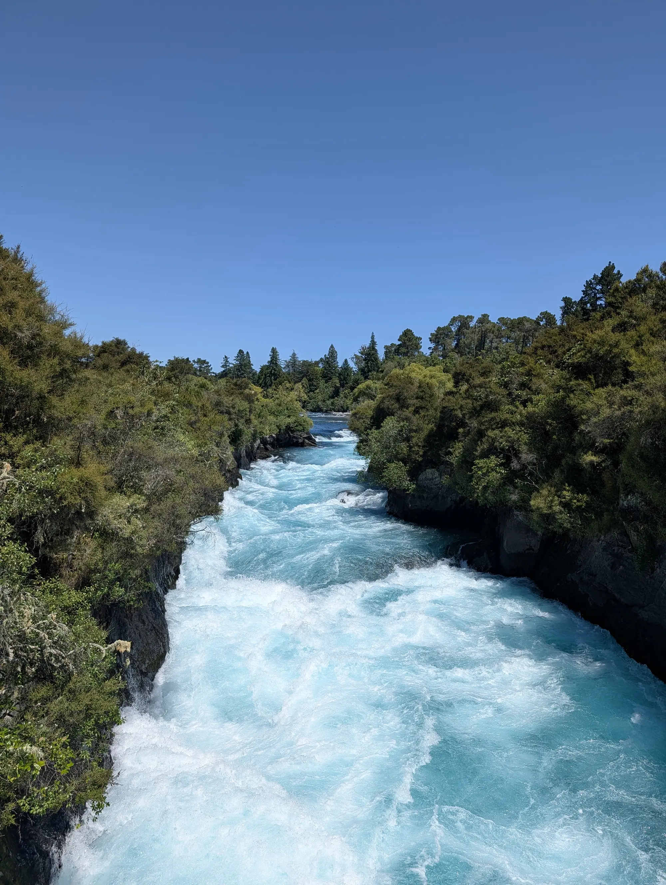
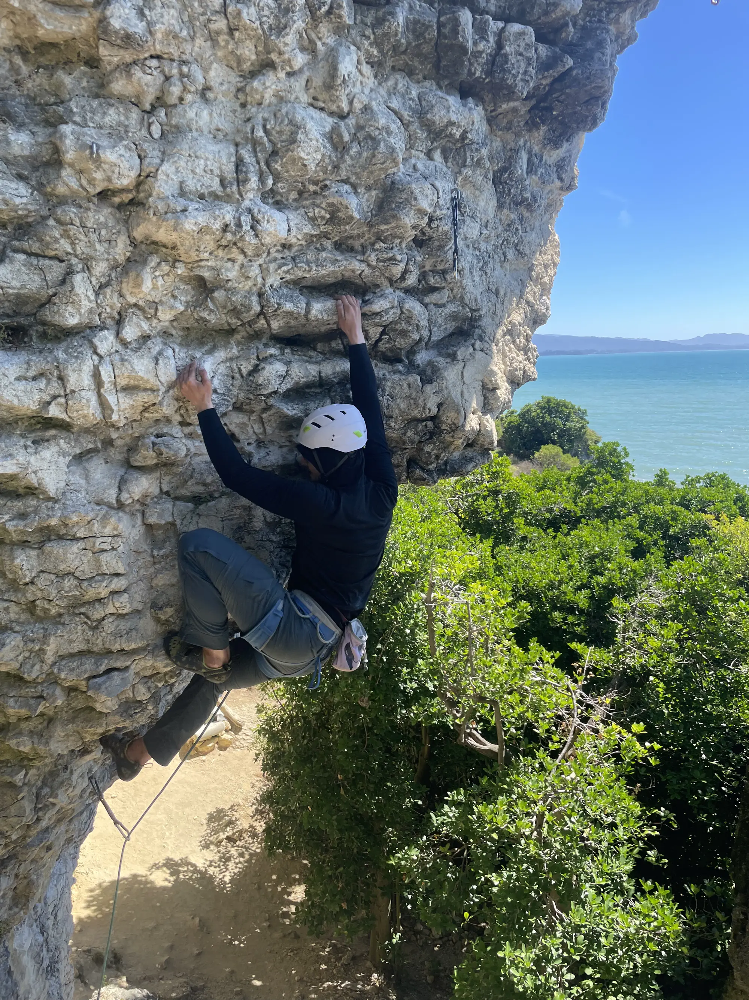
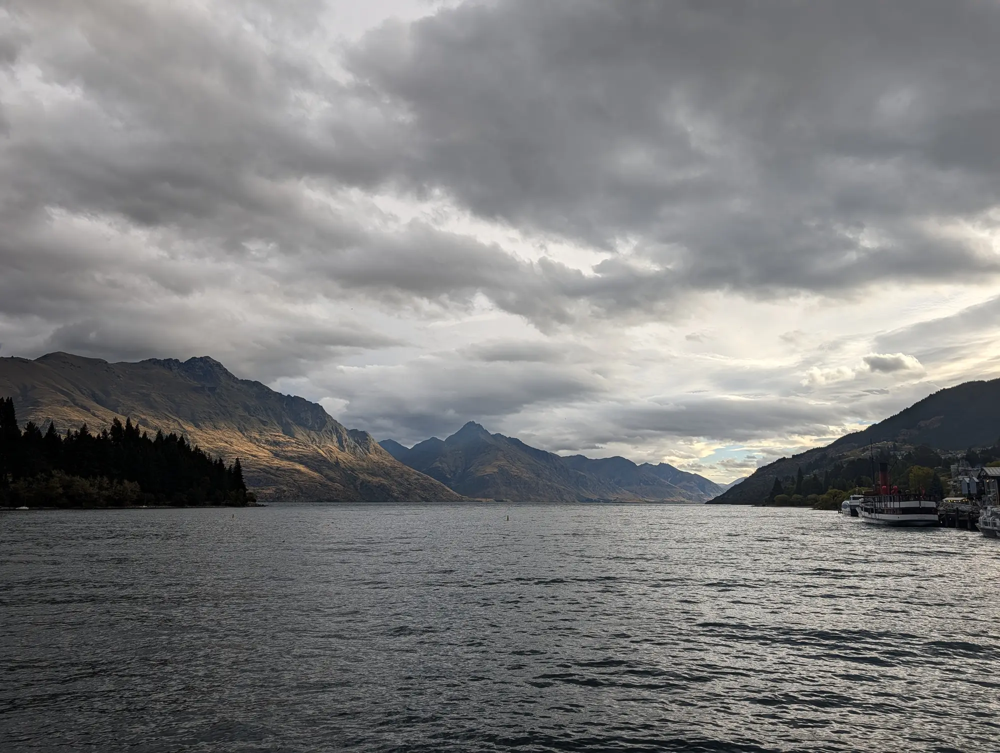
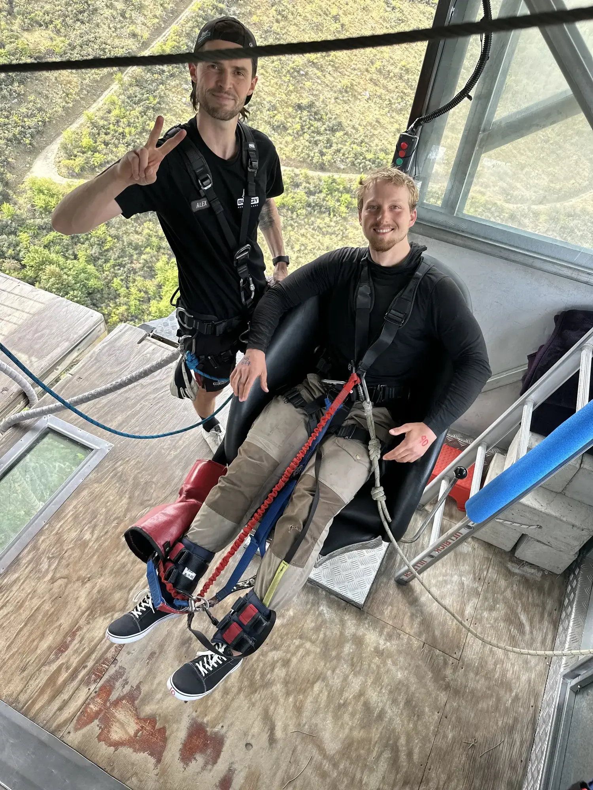
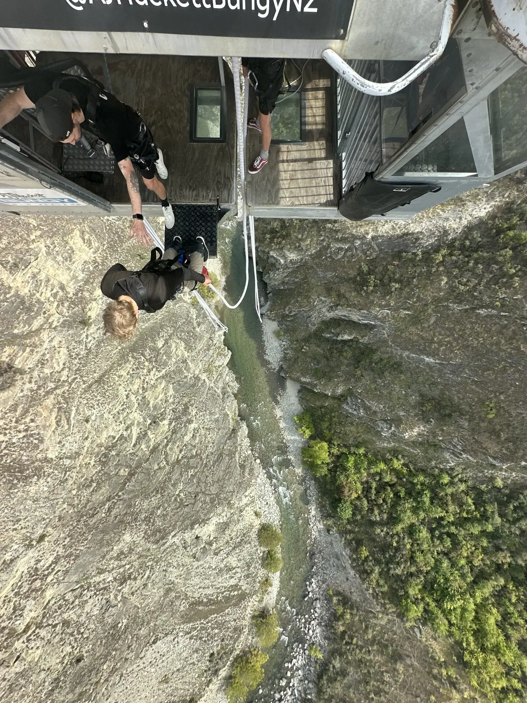
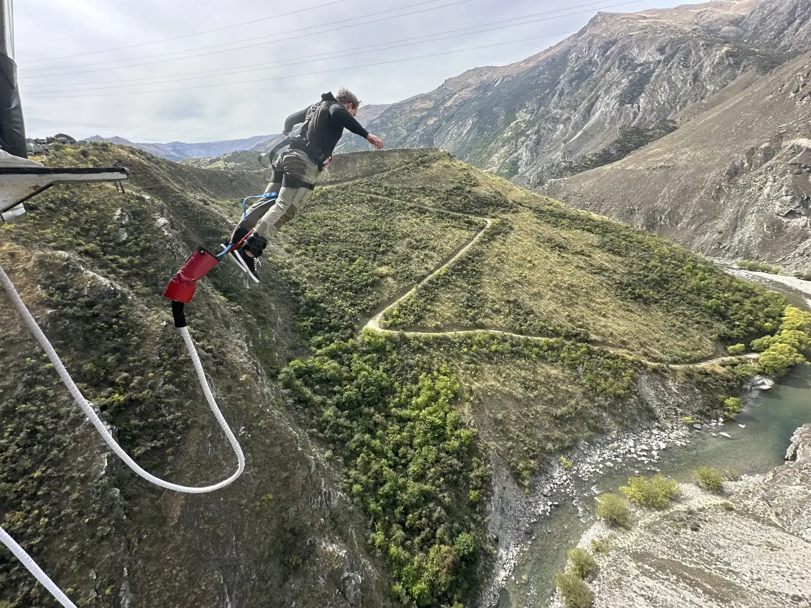
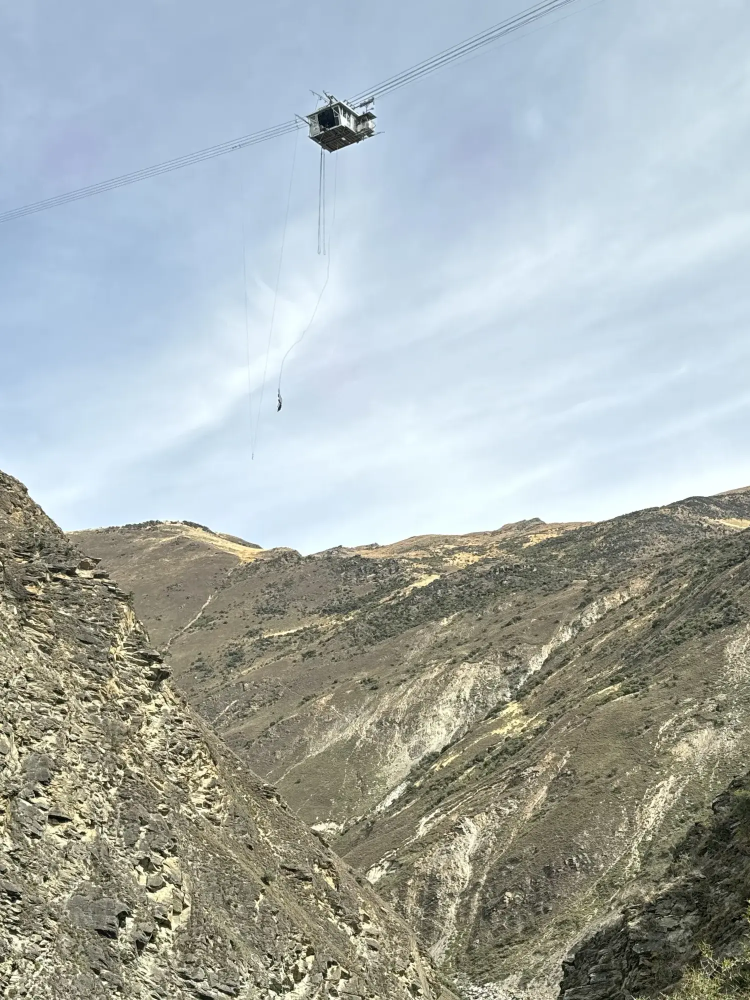

"Make sure you dive head first, and pull the cord on the second bounce. Ok, on five. Five. Four. Three—"
I stood on the edge of a platform suspended in the air far above a river, a white rope of elastic was strapped to my feet. The details of the rocks in the stream below became exceedingly clear to my mind's fear-heightened sensitivity. 
"Wait, hold on." I said.
'How in the hell did I get here?!?' I thought. 

### First Encounters:

> The falls at Taupo, which we absolutely did not go down, but is the only photo that I have of the blue of the river.

It turns out that New Zealand invented bungee jumping. This fact was little known to me when I first arrived in the country. Bungee jumping came up quickly when talking to locals about the 'must-dos' of NZ[^1].

The first time I saw someone jump, I hated it. I was tubing the crystal clear Waikato River just outside of Taupō when a cliff came into sight. Perched atop the 75m wall of welded tuff was a building, and, matryoshka doll-like, perched on the building was a man. The man jumped and strung out a huge cord of white rope tied to his ankles. As he came closer to the water line, his head was violently torqued around his center axis by the accumulating tension. He caressed the water before being jerked back to the sky by the white cord tied to his ankles, and came to rest while a boat puttered out to pick him up.

'That looked sickening!' I thought, remembering his sharp twist. 'He must have pulled a few gs doing that stunt!' 

Bungee jumping. Yeah, not for me.

### The Big Whip:

Along my journey through New Zealand, I was invited to do some climbing in  Golden Bay at a crag called Paines Ford, staying at a camp for climbers called Hangdog[^2]. The invite was itself a serendipitous connection with a fellow traveler at a Thai restaurant after two very wet days on the Timber Trail, only a few days after my time watching the twisting bungee jumper in Taupo.
New Zealand is known for its adventure culture, and while the climbing is not world-class, the chance to do something rock-related on my bike trip was something I was looking forward to. The invite to Hangdog offered me a focus for that aspiration.

Within the first two days of climbing, I was up at one of the crags, belayed by a skilled climber called Charlie. We chatted about his time as a climbing coach in the UK. Eventually, my fear of falling came up. 

By way of explanation, I love climbing. It pushes me to set fear aside, assess the actual safety of a particular move, and then act accordingly. Often, that is to act boldly, pushing myself to do what my body is convinced is certainly a life-threatening move, when in reality bolts and a competent belayer insulate me from any real risk of serious injury. 
This is not to say that climbing is a safe sport - it absolutely is not. Rather, with proper risk assessment, many moments of paralyzing fear are determined to be just head-scary, but not actually dangerous (because of good system building). I find myself drawn to these moments because they force me to see the world clearly, and do something I am afraid to do anyway.
And still, I am quite afraid of falling while leading or even top-roping any climb.

It was something that I quickly noticed was holding me back at Paines Ford. I decided to do something about it, and Charlie, I had assessed, would be a good person to practice with. 

"Oh! I have the PERFECT activity for your fear of big falls," Charlie replied to my inquiry.
"I've just put up an overhanging route, but haven't clipped the anchors, so you could take a HUGE whip from the top into clean air. It's about as good as it gets, and I bet it will help."
"Ok," I grudgingly replied, "I'll give it a shot. Will you give me a catch?"
"That's the spirit!" He replied.

In general, I tend to find myself emotionally self-contained. I don't scream on roller coasters or clutch the railing when standing over a great height. I am most comfortable hiding my anxiety behind a mask of cool, calm business-like efficiency. I go cold and kind of numb while the stress occurs.

We tied in, did our safety checks, and I quietly and coolly made my way up to the anchors. The climbing was hard, and the overhanging route constantly pulled me back to the ground. My calm acted like a thin shell over a pool of deep fear.
Eventually, I pulled the final hard moves, and the climbing settled down in my final approach to the anchors. At this point, the rope dragged below my feet, flowing through the last carabiner, firmly connected to a rock-solid bolt, down to Charlie, my counterweight, below.

I took a long look at the anchors. 
'I could just clip them and get lowered safely back to the ground,' I thought.
'You promised you would take the fall,' another voice admonished, 'plus, the fall is super safe.'
I gritted my teeth, tapping the anchors, and shouted a confident "falling" before I took the plunge and jumped off into the clean air. 

A feeling of sickening free fall filled my body as I watched the rock shoot past me. Much to my surprise, I let out a guttural "raaaawwwwwww" as my abdominal muscles forced the air from my lungs through my voice box and into the open air in their feeble attempt to keep my organs and spine together for the inevitable termination of my free fall by the ground. 

But I did not hit the ground. As expected, I came to rest about 20 feet above the ground with Charlie, my belayer, suspended three feet below me, pulled up by the momentum and his jump to give me a soft catch. 

I don't remember what happened next, but Charlie maintains that I looked down at him, eyes very wide. He proffered a hand for a fist bump, which I reciprocated. As our fists touched, a huge smile cracked across my face. I was lowered back to the ground, and did my best to suppress the giddy feeling of being super-not-dead on firm ground. 

For the rest of my time climbing at Paines Ford, I pushed on my fear of falling. I did a hard route, which required me to fall on pretty much every bolt as I made my way to the top. The fear started to retreat, and I was better able to keep my head while on the sharp end of the rope. It was not a panacea, but it helped. 

## Continued Encounters:

I eventually left Hangdog and continued south. I rode along the west coast, over the mountains to the steepest hill in the world on the east coast, before making my way back up to Queenstown. After riding in the 'deep south,' seeing Fjordland and Dunedin, I was taking it slow at the hostel. 
The day before, I met a northbound American bikepacker who asked me what I planned to do for my day off in Queenstown. 
"I don't know," I replied.
"Well, this place will take your money; it just depends on what you're interested in. You could go on the lake in a jet boat, or take the gondola up to the lookout."
"Yeah," I replied, my tone conveying my lukewarm interest.
"Or you could go bungee jump," he offered. "It is where the activity was first invented, and they have really good safety standards here."
"Really?" I replied, mulling the idea over. 
"Yeah, they have one in the Nevis valley, where you fall like 100m. It's so far, and the landscape is so distant that it feels surreal. I think AJ-Hackett does it."

The fear of falling nagged at me. When I left Paines, I had the distinct sense that I had a long way to push it. In the bungee, I saw an opportunity to take a truly massive fall in an extremely safe way. I also had nothing else that I was particularly interested in doing, and a wrist injury had sidelined the cycling for the moment. Lastly, I could not reasonably defend that I spent a day where bungee jumping was invented, and I did not jump.

The next morning, I called the AJ-Hackett Queenstown location. 
"Hello, this is Flo" came the reply on the other end of the phone.
"Hi, yeah, I was hoping to book a bungee jump." I replied. 
"Sure, we have space on our 12:30 bus if that suits you."
"That sounds good," I replied.
"Ok, well, just show up 30 minutes before to get checked in, and you'll be on your way."
She took my payment details, and we hung up the phone. 
'Well, I guess I am committed,' I thought. 

Come 12:00, I walked into the sleek white-walled glass office of AJ-Hackett in central Queenstown. The young woman behind the desk asked me for my name, then took me over to a scale to be weighed in, like a piece of checked luggage. She wrote '90' written in red on my right hand, and N8 R44 in blue on my left hand, while her colleagues teased and joked with her from the desk situated just over her shoulder.
"Ok, you're good. Go take a seat over there," she said, gesturing to a sleek area with couches and a few huddled customers reminiscent of an airport lounge. TVs mounted on the white walls showed videos of the different offerings at the AJ Hackett locations - a bungy off Auckland's harbor bridge, a 300m swing in Queenstown, a jump off of Auckland's sky tower to the ground, amongst other gravity-related endeavors.

After about 20 minutes of tense waiting, another young employee sauntered into the waiting room, declaring that it was time to go, before spinning on his heel and heading out to the bus. About 8 of us climbed into the bus, which looked much more like a military troop transporter than a shuttle bus.

We hit the road, fighting Queenstown traffic all the way out of town. 
"Hey guys," came the driver's voice over the PA. "I have a video for you, so we will play that right now."
On the front screen played an edit showing closeup shots of bungy jumpers preparing to jump, backed by thumping music.
The bus rolled to a stop, pulling into a parking lot in front of the yellow and green DOC sign for the "kawakawa bridge preserve".
"This is the stop for the Kawakawa bridge. Anyone with green on their right hand should get off now."
Everyone got off the bus except me. A long moment of lonelyness followed. 
'what am I doing!?!' I thought. 

The engine roared back to life, and two other people got on. 

"Alright, to Nevis," said the driver. 

15 mins later, we turned off onto a dirt road, through what looked like a construction site, and up a steep dirt road. I felt myself pressed into my seat by the grade. The engine's roar redoubled. Sheer drops to the canyon floor below alternating on each side of the vehicle as we ascended. 

We reached the top, and a well built modern structure, in the style of the Queenstown office, greeted us. Another young woman greeted us, and ushered the three of us inside.

As instructed, we all took off glasses, hats, and everything from our pockets, placing them into lockers. Then we checked in with the front desk, and received a ticket, printed with information that matched the writing on the backs of our hand.

From there the streamlined operation directed us to another young guy who fitted me with a harness. He expertly pulled the buckles, maneuvering, tightening, and otherwise fitting the harness with smooth practiced hands, chatting the whole time. Once I was harnesses up, he pointed me to the door to the jump. 

I walked through the door, down to a small open-air gondola which traversed a set of steel cables out to a suspended platform hanging in the middle of a huge canyon. I met back up with the two other people from the bus as we just intercepted a group of recent jumpers heading back up the path, gently cracked smiles hinting at the exhilaration they had just been through. 
We came to the gondola - which was beginning to look more like a metal basket - and another young woman ushered us into the platform. She made idle small talk, asking us where we were from (California) and whether we were excited (yes). Then she closed the door, neglecting to get ok the cart herself, and pressed the button to send us across to the platform suspended in the valley.

The three of us looked at each other. "Well, this is real" said one of my companions.

The wind picked up, gently shifting the gondola from side to side. The platform grew inexorably closer, until we bonked into it, docking against the structure in the sky.

Another young woman excitedly asked us if we were excited, before locking the cart to the platform and opening the door. We proffered our tickets to the gate woman. We walked into a small but open structure with an open rear wall, separated by a waist high railing. A sheet of glass divided the room in two, giving a view of the canyon dizzyingly far below.

We were asked to jump up on a waist high bench. We were each fitted with ankle straps, and showed how to pull a cord that would shift our weight from our ankles to our harnesses. By pulling the cord we could sit upright in the harness. If we missed the timing, our weight would not allow the pin to be released, and we would have to be dragged up to the platform upside down by our ankles. 

"Also, make sure you do a *head first* dive off the platform. You can fall forward, do a hug swan dive, or anything else, so long as your head is first."
We all nodded, our eyes beginning to widen slightly from the growing fear. 
'Oh shit,' I thought, 'I have no idea how to jump head first. Hopefully it will work itself out.'

"Ok," he said, checking the first name on his list. "Alex, are you ready."

'Well, at least I don't have to watch anyone else,' I thought.

I slid off the bench, and walk over to the railing. He asked me to show my wrists and checked the numbers written there against the ticket he held. Then he checked my harness before clipping me into the safety rail above. I was guided to a chair which was pushed back, and they attached the bungy to my ankles. Next thing I knew I was giving a camera a smile, and shuffling to the grip-taped edge of the platform.

Freed from the chair, I shuffled in smaller increments to the open back of the platform, and the waiting edge. As I got closer, my hand instinctively reaching out to steady my progress towards the edge.

The water below was very very far below. Directly below me over the edge the crystal clear air did nothing to blur the detail of the white water rapids at the distant bottom of the canyon. 

"Just remember to dive head first. Alright jump in in five, four, three—"
"Woah woah woah, can I get a second" I said.
"What are you waiting for mate?" Replied the Kiwi,
I was not entirely sure I knew how to fall head first, and my protest was intended to give me a second to think it through. 'You know that no amount of thinking will magically give you the somatic understanding and/or confidence to jump off, right' a voice inside my head said. 'You'll just have to do it'.
I looked back at over the edge. 
"Ok," said the kiwi, "five, four, three, two,"

On 'one' I jumped[^3].

Suddenly, the wind roared in my ears, the canyon got a LOT closer, and a huge pit opened in the bottom of my stomach. Then my throat made a gutteral "raaaawwwwwww" as my abdomen tightened. 
I kept falling. 'wow,' I thought, 'this is long.'
Suddenly my view of the blue water in the river below was wrenched away and gravity returned. There was a fleeting moment of static before I was rocketed back up by the elastic cord strapped to my ankles. The vertical acceleration felt much more tolerable to me than the free fall, but it was short lived. I felt myself slow again, and the the pit reopened in my stomach. 
'ok, that was the first bounce, I thought. Top of the second is when you pull the cord.'
Ok my next bounce up, I looked up at my feet, and pulled myself up on the red safety tether til I could reach the green pull line. Firmly grasping the line, I jerked it to the left, and the buckle came loose with a click.

Upright, and no longer falling, I was beginning to feel much more comfortable. It was reminding me of sitting in a harness, resting after a climbing fall. 

I looked around. The bedding planes of the schist making up the canyon wall dipped to my left. A gull rode the thermals to my right. My attention next drifted to the cord suspending me. It was white, and made of a firearm-thick coil of rubber elastic threads, as if a huge number of extremely long white rubber bands had been assembled into a rope. I put a hand on the cord. The surface was elastic under the pressure of my pinch. 

Suddenly a loud click startled me out of my revery. The draw line has been attached to my end of the cord, and now winched me up back to the platform. The ground slowly receded as I ascended.

I came level with the platform, then I was drawn to the platform again. I stepped off, and suddenly found myself on the other side of the gate again. 

"How was it?" Asked the employee unclipping my tether line. "That was quite the sound you made."
"Yeah, thanks it was good."

I went to take my seat on the bench, shaken from the dump of adrenaline my body had just endured.

I looked over the gate. The second rider was already in the chair getting fitted with the bungy. I turned to the third of our group. 
"So do y'all do much adventure sports?" I asked.
"Yeah," she replied.
We both snapped our attention to the glass pane in the center of the platform as a dot slowly bounced back towards us. 

The crew on the platform sprung into action, starting to lower the redraw cord, as the jumper below pulled himself to a sitting position.

As he came up, the woman was called and proffered her wrists, and was led behind the gate for her own jump.

The whole operation was smooth, mechanical, and deeply systematic. It reminded me of watching roughnecks string pipe in videos of the oil industry - the high exposure environment, men tethered by full body harnesses to a line above their heads, and a constant motion gave the pacing the same smooth rhythm. As soon as one step was finished, the next one was already half done. No one rushed, and everything was smooth and efficient. They appeared to have practiced a thousand times. The rising line was dropped down, and she was drawn up, delivered to the safe side of the fence, and returned to the bench where we sat. The flurry of activity which had characterized the edge-side of the fence suddenly stopped - the machine idled, as soon as the stream of jumping patrons had come to an end.

As soon as all the equipment was removed, we were ushered back to the gondola, as if nothing had happened. For them, it was just another day at the same old office, and it was easy to let their mundane nonchalant attitude rub off.

I certainly let it rub off on me. The rush of the fall had felt just a little overwhelming. All the adrenaline and cortisol, dumped into my brain all at once by the fall, had left me feeling hollow and tired. Back up at the bus stop, harnesses removed, the bunch of jumpers from our round, as well as the round before, sat cooly chitchatting or staring into space. 

When the bus arrived, I sat, looking out the window, letting my mind wander in its subdued state. We arrived back on the streets of Queenstown 45 minutes later. And with that our jump ended. I went off to find something to eat. 

## Terra Firma

The jury is still out on whether that biggest of big whips effected my climbing, but my sense is that some barrier in my brain has broken, and that the acute fear related to falling is gone. It's as if I have cried the biggest call of wolf to my body, falling to my death, only for the hand of good preparation to snatch my mortal form from certain disaster. 
'yeah, right,' I can imagine my body saying the next time I end up on the sharp end, fixing to fall. 'It was ok last time, even if we put out so much stress about it. What is the point of all that stress this time?'
Of course, only time - and a return to climbing - will tell. I hope to retain my healthy fear. I have no interest in dying climbing or falling off a cliff. But I am interested in seeing the world clearly and keeping a cool head under pressure. I suspect that this fall will help me in that direction. 

And regardless of whether the fear is dulled in the future, I have proven beyond a shadow of a doubt that I can cut through my fear and do something my body really does not want to do, if I have deemed it safe to do. 
And that skill is not only for climbing or bungy jumping - that is a deeply important life skill, crucial for taking chances of all kinds, one that I intend to make good use of in my own life.

## Footnotes:

[^1]: Pronounced as "en zed" by the locals.

[^2]: For the record, you do not need an invite. It just ended up on my radar because someone invited me to join them.

[^3]: Falling is a weird thing to describe. Partly it is a fully somatic experience, and partly you don't remember it at all. It makes the description quite slippery to generate. 
