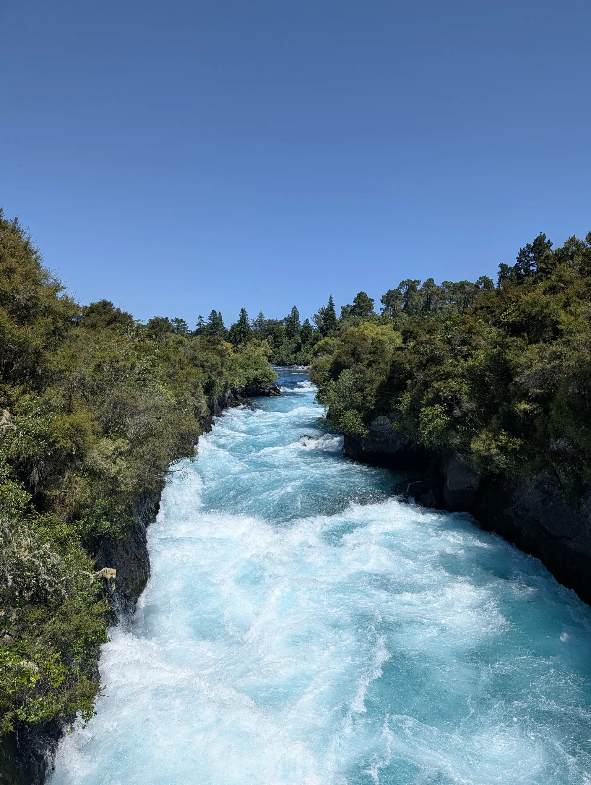
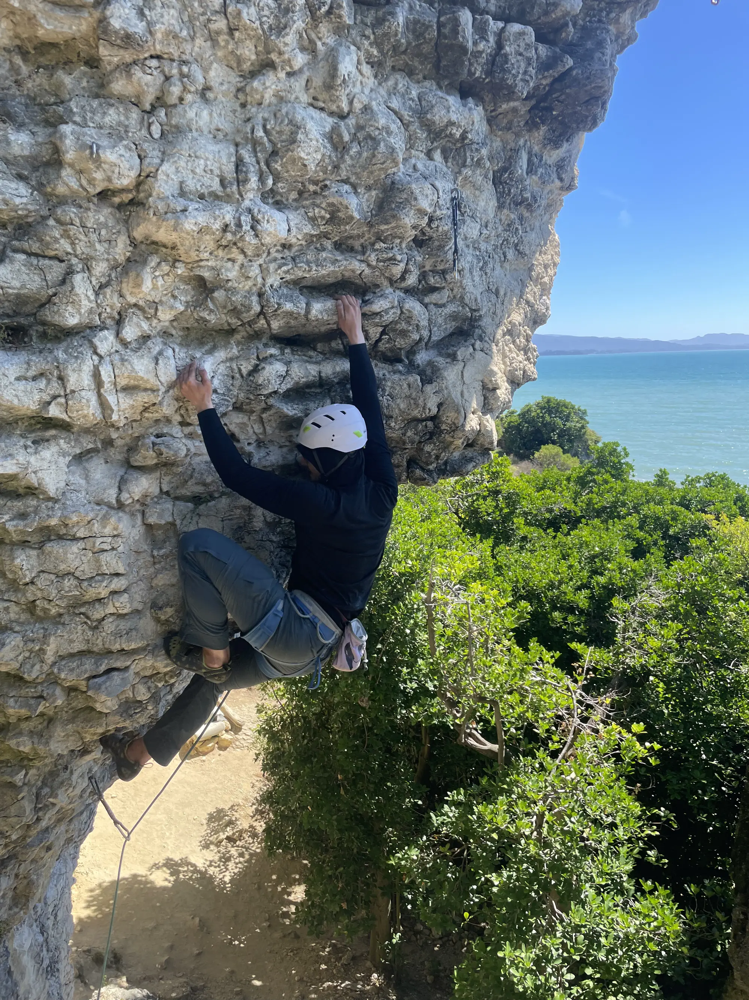
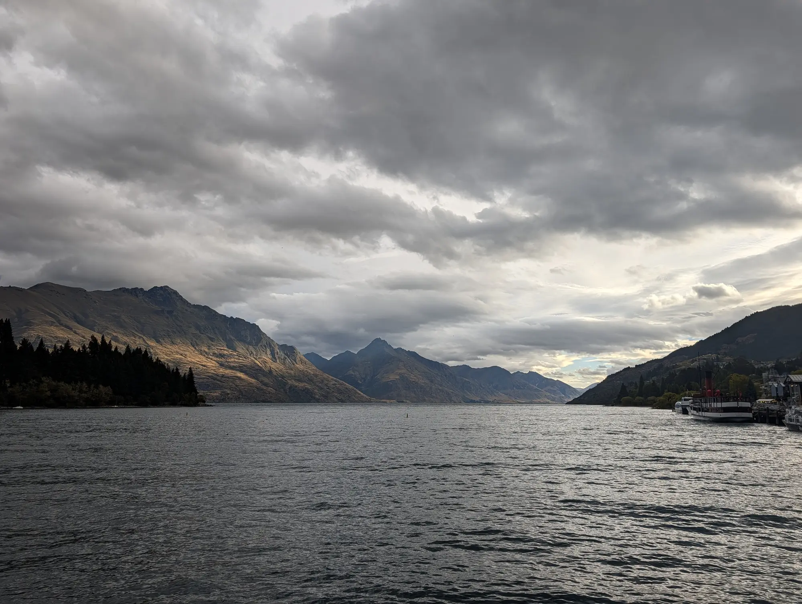
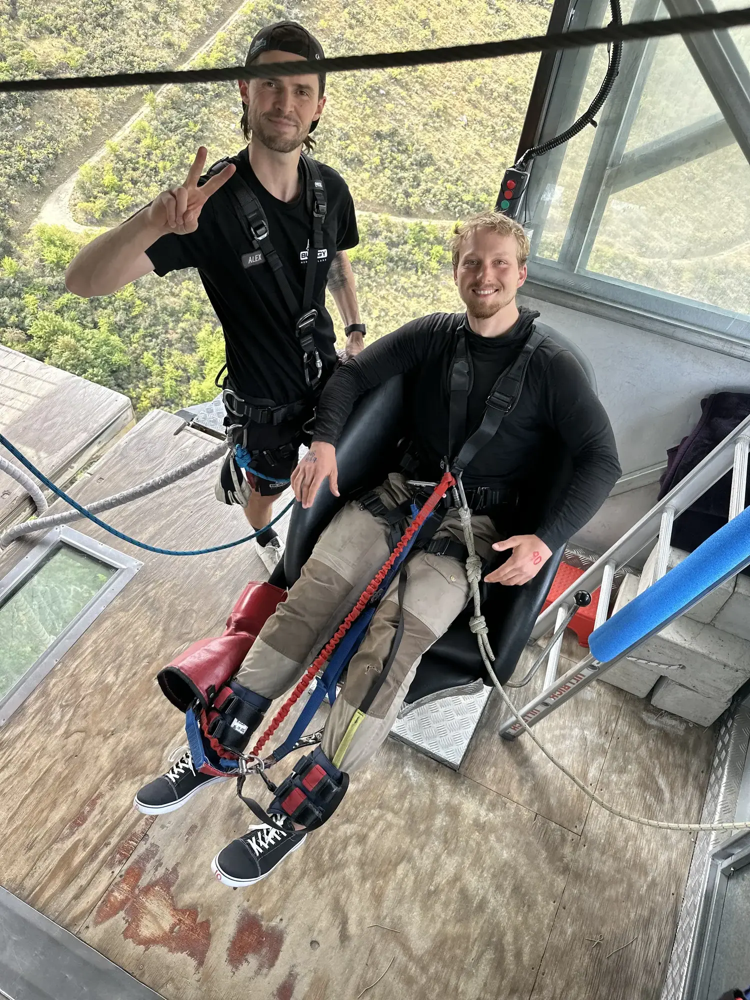
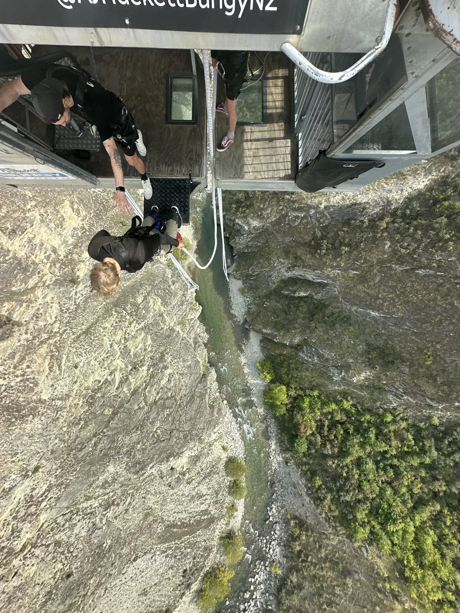
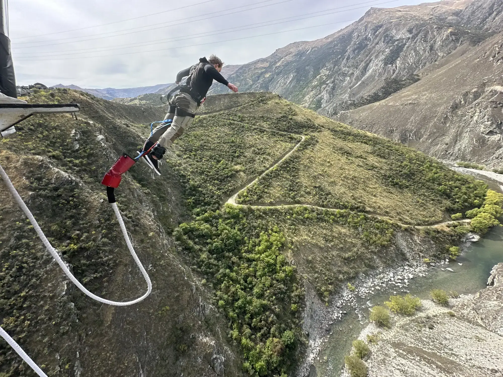
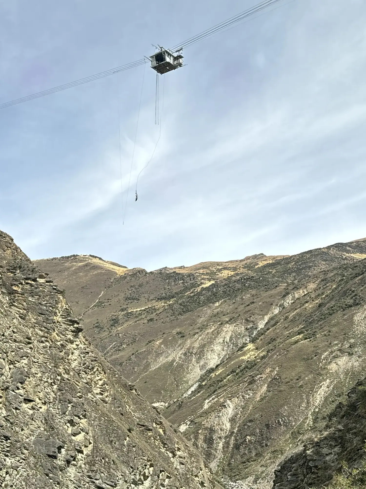

"Make sure you dive head first, and pull the cord on the second bounce. Ok, on five. Five. Four. Three—"
I stood on the edge of a platform suspended in the air far above a river, a white rope of elastic was strapped to my feet. The details of the rocks in the stream below became exceedingly clear to my mind's fear-heightened sensitivity. 
"Wait, hold on." I said.
'How in the hell did I get here?!?' I thought. 

### First Encounters:

It turns out that New Zealand invented bungee jumping. This fact was little known to me when I first arrived in the country. Bungee jumping came up quickly when talking to locals about the 'must-dos' of NZ[^1].

> The falls at of the Waikato River below the section of the river we rafted. Needless to say we did no go down this section, but the water was this blue.

The first time I saw someone jump, I hated it. I was tubing the crystal clear Waikato River just outside of Taupō when a cliff came into sight. Perched atop the 75m wall of welded tuff was a building, and, matryoshka doll-like, perched on a small platform protruding off the building over the water was a man. He was WAY up there, a huge cord of white rope hanging down from his ankles. Then he jumped off the platform.

Caught by the freeze response of a someone jumping to their death, I mutely watched as he hurtled past the folded center of the white cord, downward to the water. His jump had not been perfect. He left the platform at an angle, and as the cord became taught, it violently twisted him so that he went from prone to upside down in a quick jerk. His head - and only his head - made contact with the clear blue water below. 

He bounced, ripped up by the white cord. Mercifully he came to rest, suspended by his ankles, and a boat puttered out to pick him up.

'My god. That looked sickening' I thought, remembering his sharp twist. 'He must have pulled a few G's doing that stunt!' 

Bungee jumping. Yeah, not for me.

### The Big Whip:

But I was not done with falling on this trip.

Along my journey through New Zealand, I was invited to do some climbing in the Golden Bay region of NZ at a crag called Paines Ford. I stayed at a camp for climbers called Hangdog[^2]. The invite was itself a serendipitous connection with a fellow traveler at a Thai restaurant after two very wet days on the Timber Trail, only a few days after my time watching the twisting bungee jumper in Taupo. So much of my time in NZ was like this - the winds of the world took me where they pleased, and it was clear to me that I was, by and large, along for the ride. 
Climbing? Sure. I was just along for the journey.

New Zealand is known for its adventure culture and so I had been primed to expect some opportunity to engage in those outdoor pursuits I so enjoyed from back home. And while the NZ rock climbing is not considered world-class[^4], the chance to do something rock-related on my bike trip was something I was looking forward to even before I left. I considered and rejected bringing a pair of climbing shoes. 
The invite to Hangdog was welcome, and offered me a focus for that aspiration.

Within the first two days of climbing, I was up at one of the crags, belayed by a skilled climber called Charlie. We chatted about his time as a climbing coach in the UK, and his extended working holiday in NZ. Eventually, my fear of falling came up.

By way of explanation, I love climbing. It pushes me to set fear aside, assess the actual safety of a particular move, and then act accordingly. Often, for me and most other climbers, that is to act boldly, pushing myself to do what my body is convinced is certainly a life-threatening move. While the fear of death is acutely there, reality is that bolts and a competent belayer insulate any climber from as high a risk of life threatening injury as your fear leads you to believe. 
This is not to say that climbing is a safe sport - it absolutely is not, and its safety relies entirely on the systems and habits you build and maintain. Rather, with proper risk assessment, many moments of paralyzing fear are determined to be just head-scary, but not actually dangerous. I find myself drawn to these moments because they force me to see the world clearly, and do something I am afraid to do anyway.
And still, I am quite afraid of falling while leading or even top-roping any climb.

It was something that I quickly noticed was holding me back at Paines Ford. I couldn't blame only my hands, or the unfamiliar grading system, or my cycling focused strength. Nope, it was my fear. I *could* pull the move, but I didn't want to. 

I decided to do something about it, and Charlie, I had assessed, would be a good person to practice with. 

That second day I brought my fear as we sat at the base of the crag and switched roles.
"Oh! I have the PERFECT activity for your fear of big falls," Charlie replied to my inquiry.
"I've just put up an overhanging route, but haven't clipped the anchors, so you could take a HUGE whip from the top into clean air. It's about as good as it gets, and I bet it will help."
I looked at the route he gestured to. A large face of yellow-white limestone towered over me. The top of the route stuck out from the base about 7 feet, and the overall height was around 60. A set of black quickdraws dangled from the bolts, which became progressively sparser higher up the wall. As Charlie said, any fall would leave me in clean air because of the overhang of the wall.

"Ok," I grudgingly replied, "I'll give it a shot. Will you give me a catch?"
"That's the spirit!" He replied.

I guess I agreed to Charlie's offer because I had become increasingly frustrated with the single block to any progress in my climbing - the fear. I had also assessed that the route was safe, and Charlie was probably competent enough to trust my life to.

In general, I tend to find myself emotionally self-contained. I don't scream on roller coasters or clutch the railing when standing over a great height. I am not a fan of either thing, but I show it retreating into myself and disengaging, until I can safely scurry away. I am not performative in my fear. Instead, I am most comfortable hiding my anxiety behind a mask of cool, calm business-like efficiency. I go cold and kind of numb while the stress occurs.

We tied in, did our safety checks, and I quietly and coolly made my way up to the anchors. I remember very little of the climbing, except that it was physical, and gravity plus the overhanging route constantly pulled me back to the ground. My calm acted like a thin shell over a pool of deep fear.
Eventually, I pulled the final hard moves over the budge that put me back on positive ground and I could get my feet under me. The climbing settled down in its final approach to the anchors. The rope dragged below my feet, flowing through the last carabiner, which I could no longer see, firmly connected to a rock-solid bolt, down to Charlie, my counterweight, below.

I took a long look at the anchors. They were right there beckoning to me to just clip them.
'I could just clip them and get lowered safely back to the ground,' I thought.
'but the fall is super safe, you are stuck on this fear,' another voice admonished ' And you promised you would take the fall.' 
I stood for a moment, locked in place between my two selves.
I gritted my teeth, tapping the anchors, and shouted a confident "falling" before I took the plunge and jumped off into the clean air. 

The sickening free fall filled my body as I watched the rock accelerate past me. Much to my own surprise, I heard a guttural "raaaawwwwwww", as my abdominal muscles forced the air from my lungs through my voice box and into the rushing open air in their feeble attempt to keep my organs and spine together for the inevitable and sudden termination of my free fall by the ground. 

But I did not hit the ground. I was suddenly slowed, until I hung motionless in the air. As expected, I came to rest about 20 feet above the ground with Charlie, my belayer, suspended three feet below me, pulled up by the momentum and his jump to give me a soft catch. 

I don't have an embodied memory of what happened next, but Charlie maintains that I looked down at him, eyes very wide. He proffered a hand for a fist bump, which I slowly reciprocated, leaning down from my harness. As our fists touched, a huge smile cracked across my face. Charlie lowered himself and me back to the ground, and did my best to suppress the giddy feeling of being super-not-dead on firm ground. Then we hiked out of the crag, and I went back to my tent and, exhausted from the exhilaration, took a nap.

For the rest of my time climbing at Paines Ford, I pushed on my fear of falling. I did a hard route, which required me to fall on pretty much every bolt as I made my way to the top. Each fall was slightly less scary than the last and I eventually topped out the route. The fear started to retreat, and I was better able to keep my head while on the sharp end of the rope. It was not a panacea, but it helped. 

## Jumping:

I eventually left Hangdog and continued south. I rode along the west coast, over the mountains to the steepest hill in the world on the east coast (in a largeish college town called Dunedin), before making my way over to the "deep south" of NZ in the town of Te Anau, before eventually returning to Queenstown. I was nearing the end of my trip, and starting to say goodbye to New Zealand and I was taking it slow at the hostel.
The day before, I met a northbound American bikepacker who asked me what I planned to do for my day off in Queenstown. 
"I don't know," I replied.
"Well, this place will take your money; it just depends on what you're interested in. You could go on the lake in a jet boat, or take the gondola up to the lookout."
"Yeah," I replied, my tone conveying my lukewarm interest.
"Or you could go bungee jump," he offered. "It is where the activity was first invented, and they have really good safety standards here."
"Really?" I replied, mulling the idea over. 
"Yeah, they have one in the Nevis valley, where you fall like 100m. It's so far, and the landscape is so distant that it feels surreal, like you aren't even really jumping. I did it and it was wild. I think AJ-Hackett does it."

The fear of falling nagged at me. When I left Paines, I had the distinct sense that I had a long way to go. In the bungee, I saw an opportunity to take a truly massive fall in an extremely safe way. I also had nothing else that I was particularly interested in doing, and a wrist injury - what I would come to find out later was a broken wrist - had sidelined the cycling for the moment. Lastly, I could not reasonably defend that I spent a day where bungee jumping was invented and didn't jump. The reasons were no match for the nagging dread, which I didn't even feel yet. In a purely rational assessment, I just could not pass the opportunity up.

The next morning, I called the AJ-Hackett Queenstown location. 
"Hello, this is Flo" came the reply on the other end of the phone.
"Hi, yeah, I was hoping to book a bungee jump," I replied. 
"Sure, we have space on our 12:30 bus if that suits you."
"That sounds good," I replied.
"Ok, well, just show up 30 minutes before to get checked in, and you'll be on your way."
She took my payment details, and we hung up the phone. 
'Well, I guess I am committed,' I thought.
I had made the least cost path jumping off a cliff.

Come 12:00, I walked into the sleek white-walled glass office of AJ-Hackett in central Queenstown. The young woman behind the desk asked me for my name, then took me over to a scale to be weighed in, like a piece of checked luggage. She wrote '90' written in red on my right hand, and N8 R44 in blue on my left hand, while her colleagues teased and joked with her from the desk situated just over her shoulder. 
Sufficiently barcoded, I was told "Ok, you're good. Go take a seat over there," she said, gesturing to a sleek area with the high ceilings of a modern airport gate. Some scattered couches held a few huddled customers. TVs mounted on the white walls showed videos of the different offerings at the AJ Hackett locations - a bungy off Auckland's harbor bridge, a 300m swing in Queenstown, a jump off of Auckland's sky tower to the ground all blurred by as we pensively waited for our call.

After about 20 minutes of this tense waiting, another young twenty-something employee sauntered into the waiting room, declaring that it was time to go, before spinning on his heel and heading out to the bus. We all looked around, before following him out. About 8 of us climbed into the bus, which looked much more like a military troop transporter than a shuttle bus.

We hit the road, fighting Queenstown traffic all the way out of town. 
"Hey guys," came the driver's voice over the PA in a style reminiscent of California cool, but with an indistinguishable foreign accent. "I have a video for you, so we will play that right now."

On the front screen, a video showing close-up shots of bungee jumpers preparing to jump played, backed by thumping music. The video was a similar highlight we passively watched in the lounge, and we all passively watched this one as well.
The bus rolled to a stop, pulling into a parking lot in front of the yellow and green DOC sign for the "Kawakawa Bridge Preserve".
"This is the stop for the Kawakawa bridge. Anyone with green on their right hand should get off now."
Everyone got off the bus except me.
'What am I doing!?!' I thought. 

The engine roared back to life, and two other people got on. "Alright, to Nevis," said the driver. 

Fifteen minutes later, we turned off onto a dirt road, through what looked like (and was) a construction site, and up a steep dirt road. I felt myself pressed into my seat by the double digit grade. The engine's roar redoubled. Sheer drops to the canyon floor below alternated on each side of the vehicle as we ascended. 

We reached the top, and a well-built, modern structure in the same style as the Queenstown office loomed before us. Another young woman greeted us and ushered the three of us inside.

As instructed, we all took off our glasses, hats, and anything from our pockets and placed them in the lockers. Then we checked in with the front desk and received a ticket, printed with information that matched the writing on the backs of our hand.

From there, the streamlined operation directed us to another young guy who fitted me with a harness. He expertly pulled the buckles, maneuvering, tightening, and otherwise fitting the harness with smooth, practiced hands, chatting with his college next to him the whole time. It was clear that for him this was just another customer but for me this was a not-entirely-positive-once-in-a-lifetime experience.

Once I was harnesses up, he pointed me to the jump door. I walked through the door, down to a small path, to a small open-air gondola which traversed - it appeared - a set of steel cables out to a suspended platform hanging in the middle of a huge canyon. The canyon was very wide and very deep. The rough metamorphic strata was jaggedly visible on the sides of the canyon. The river below was not. 
I met back up with the two other people from the bus as we just intercepted a group of recent jumpers heading back up the path, gently cracked smiles hinted at the exhilaration they had just been through. We came to the gondola, which with every step was beginning to look more and more like nothing more sturdy than a metal basket, and another young woman ushered us onto the gondola's platform. 
She made idle small talk, asking us where we were from (California) and whether we were excited (yes). Then she closed the door, neglecting to get in the cart herself, and pressed the button to send us across to the platform suspended in the canyon.

The three of us looked at each other. "Well, this is real!" said one of my companions[^5].

The wind picked up, gently shifting the gondola from side to side. The platform grew inexorably closer - akin to the death star - until we bonked into it, docking against the structure suspended in the sky.

Another young woman in an black AJ Hacket t-shirt excitedly asked us if we were, ourselves, excited before locking the cart to the platform and opening the door. We proffered our tickets to the gate woman and walked into a small but open structure with no rear wall, separated by a waist-high railing. A sheet of glass perpendicular to the wall-less side neatly divided the room in half and offered a dizzying view of the canyon far below.

We were asked to jump up onto a waist-high bench. Then the gate lady, with the help of another employee who had come from behind the waist high wall, were each fitted with ankle straps and shown how to pull a cord that would shift our weight from our ankles to our harnesses. That part was important - by pulling the cord, we could sit upright in the harness. If we missed the timing, our weight would prevent the pin from releasing, and we would have to be dragged up to the platform upside down by our ankles. 

"Also, make sure you do a *head first* dive off the platform. You can fall forward, do a swan dive, or anything else, so long as your head is first."
We all nodded, our eyes beginning to unconsciously widen from the growing fear. 
'Oh shit,' I thought, 'I have no idea how to jump headfirst. Hopefully that will work itself out before I get to the jumping part.'

"Ok," the guy said, checking the first name on his stack of cards. "Alex, are you ready?"

The dread most concretely settled into the bottom of my stomach. 'Well, at least I don't have to watch anyone else,' I thought.

I slid off the bench and walked over to the railing. He asked me to show my wrists and checked the numbers written there against the ticket he held. Then he checked my harness before clipping me into the safety rail above. 

It was at this point that the inexorable flow of the least cost path I had decided to take earlier that morning by signing up for this crazy adventure began to pull me more than I was pushing. If I were a paddler with a canoe heading down river, the evening before I had contemplated a fork in the river that would take me over a small waterfall. I weighed the options and decided that in the abstract it would be worthwhile to go over that falls, and that I should take the fork. The next morning when I had booked my jump, I firmly passed the beyond the point where I could easily turn back. By the time I got on the bus I was committed to the flow and the plunging trip over the approaching water fall, I was beyond the threshold, I just didn't know it yet. It was only once I was past the gate that it became very clear to me that, no matter what I did, I had almost no choice but going over the waterfall. I was in the grip of the current, and nothing I could do would stop my inexorable motion down the flow. The decision was no longer mine. I had traveled over the event horizon.

After being clipped to the rail, I was lead - more like gently pushed - into a chair that was suddenly reclined back. The guy attached the bungee to the braces strapped to my ankles ankles. Next thing I knew I was giving the camera a smile, and back on my feet, ushered nearer to the edge.

I shuffled in progressively smaller increments to the open back of the platform and the sheer edge. As I got closer, my hand instinctively reached out to steady my progress towards the edge.

The water was very, very far below. Dizzyingly far. Directly below me, over the edge, the crystal-clear air did nothing to blur the detail of the white-water rapids at the far distant bottom of the canyon. 

"Just remember to dive headfirst. Alright, jump in in five, four, three—"
"Whoa whoa whoa, can I get a second?" I said.

I was still not entirely sure I knew how to fall headfirst. The time between when the idea of diving head first was mentioned and now had not sufficiently prepared me to fall head first. My protest was intended to give me a bit longer to think it through. 
'You know that no amount of thinking will magically give you the somatic understanding and/or confidence to jump off, right?' a voice inside my head said. 'You'll just have to do it.'

"What are you waiting for, mate?" Replied the Kiwi.
I looked back over the edge. A second past.
"Ok," said the kiwi, "five, four, three, two,"

On 'one' I jumped[^3].

Suddenly, the wind roared in my ears, the canyon got a LOT closer very quickly. A huge pit opened in the bottom of my stomach. Then my throat made a guttural "raaaawwwwwww" as my abdomen tightened.
Then I kept falling. 'Wow this is long,' I thought.

Suddenly, my view of the rapidly approaching blue water in the river below was wrenched away. Gravity returned. There was a fleeting moment of stillness as I reached the apex of the fall, before I was rocketed back up by the elastic cord strapped to my ankles. The vertical acceleration felt much more tolerable to me than the free fall, but it was short-lived. At the top of that throw, I felt myself slow again, and the pit reopened and gushed out dread in the bottom of my stomach. 
'Ok, that was the first bounce, I thought. Top of the second is when you pull the cord.'
On my next bounce up, I looked up at my feet, and desperately pulled myself up the red safety tether on my hurt wrist until I could reach the green pull line. Firmly grasping the line, I jerked it to the left. An desperate eternity passed. The buckle came loose with a click.

Upright and now just bouncing, I was beginning to feel much more comfortable. It was reminding me of sitting in a harness, resting at an anchor on a multipitch route or after a climbing fall. That is a position I have no fear around.

I looked around. The bedding planes of the schist making up the canyon wall dipped to my left. A gull rode the thermals to my right. My attention next drifted to the cord suspending me. It was white and made of a forearm-thick coil of rubber elastic threads, as if a huge number of extremely long white rubber bands had been assembled into a rope. I put a hand on the cord. The surface was elastic under the pressure of my pinch. 

Suddenly, a loud click startled me out of my reverie. The big metal bracket of a draw line had been dropped to my end of the cord, and now winched me up back to the platform. The ground slowly receded underneath me as I ascended.

I came level with the platform, then I was drawn to the platform again. I stepped off and suddenly found myself on the other side of the gate again. The professionals had lead me without my noticing back to safety. 

I was over the waterfall, out of the plunge pool and into the calm regular water beyond.

"How was it?" Asked the employee, unclipping my tether line. "That was quite the sound you made."
"Yeah, thanks. It was good."

I went to take my seat on the bench, bone tired from the dump of adrenaline my body had just endured.

I looked over the gate. The second jumper was already in the chair getting fitted with the bungy. I turned to the third of our group. 
"So do y'all do much adventure sports?" I asked.
"Yeah," she replied.
We both snapped our attention to the glass pane in the center of the platform as a dot slowly bounced back towards us. Then the crew on the platform sprang into action, lowering the draw cord, as the jumper below pulled himself to a sitting position. As he came up on the draw line, the woman I had spoken to was called up and, like me, proffered her wrists and was led behind the gate for her own jump.

The whole operation was smooth, mechanical, and deeply systematic. It reminded me of watching a video of roughnecks string pipe on an oil drill - the high-exposure environment, men tethered by full-body harnesses to a line above their heads, and a constant motion gave the pacing the same smooth rhythm. As soon as one step was finished, the next one was already half done. No one rushed, and everything was smooth and efficient. They appeared to have practiced a thousand times. The dragline was again dropped down, and the jumper was drawn up, delivered to the safe side of the fence, and quickly returned to the bench where we sat. The flurry of activity which characterized the edge-side of the room suddenly stopped - the machine of their motion idled, as soon as the stream of jumping patrons had come to an end.

As soon as all the equipment was removed, we were ushered back to the gondola as if nothing had happened. For them, it was just another day at the same old office. And it was easy to adopt their mundane, nonchalant attitude.

I certainly let it rub off on me. The rush of the fall had felt just a little overwhelming. It clipped the top end of my emotional range, and everything beyond checking my wrists had become an emotionless blur. All the adrenaline and cortisol dumped into my brain had left me feeling hollow and tired. Back up at the bus stop, harnesses removed, the bunch of jumpers from our round, as well as the round before, sat coolly chitchatting or staring into space. 

On the bus back, I sat looking out the window, letting my mind wander in its subdued state. 45 minutes later, when we arrived back on the streets of Queenstown, I went off to find something to eat.

## Terra Firma

The jury is still out on whether that biggest of big whips affected my climbing, but my sense writing this on a bus back to Christchurch for my plane back the states, is that some barrier in my brain has broken, and that the acute fear related to falling is gone. It's as if I have cried the biggest call of wolf to my body, falling to my death, only for the hand of good preparation to snatch my mortal form from certain disaster. 
'Yeah, right,' I can imagine my body saying the next time I end up on the sharp end, fixing to fall. 'It was ok last time, even if we put out so much stress about it. What is the point of all that stress this time?'
Of course, only time - and a return to climbing - will tell. I hope to retain my healthy fear. I have no interest in taking that long fall for real. But I am interested in seeing the world clearly and keeping a cool head under pressure. I suspect that this jump, and the others I did in NZ will help me in that direction. 

And regardless of whether the fear is dulled in the future, I have proven beyond a shadow of a doubt that I can cut through my fear and do something my body really does not want to do if I deem it safe to do so. 
And that skill is not only for climbing or bungee jumping - that is a deeply important life skill, crucial for taking chances of all kinds, one that I intend to make good use of in my own life.

## PS:

If you want to watch the full 'edit' of the jump, the fine folks at AJ Hackett created a video of it. It was certainly part of the vibe of the place to make such a video. 

Find it here:
https://photos.app.goo.gl/qwS5Scsx9G3b3S5V6

## Footnotes:

[^1]: Pronounced as "en zed" by the locals.

[^2]: For the record, you do not need an invite. It just ended up on my radar because someone invited me to join them.

[^3]: Falling is a weird thing to describe. Partly it is a fully somatic experience, and partly you don't remember it at all. It makes the description quite slippery to generate. 

[^4]: Thailand and Vietnam are internationally regarded for there climbing, though the best climbing in Oceania is certainly in NZ - its where the rocks are!

[^5]: He actually said this.
