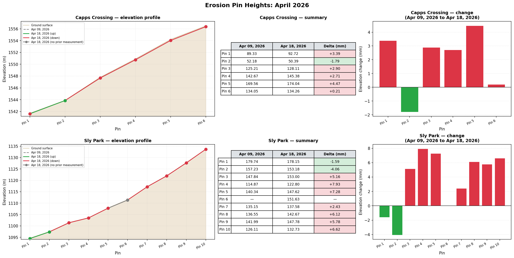
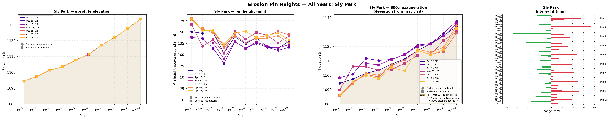
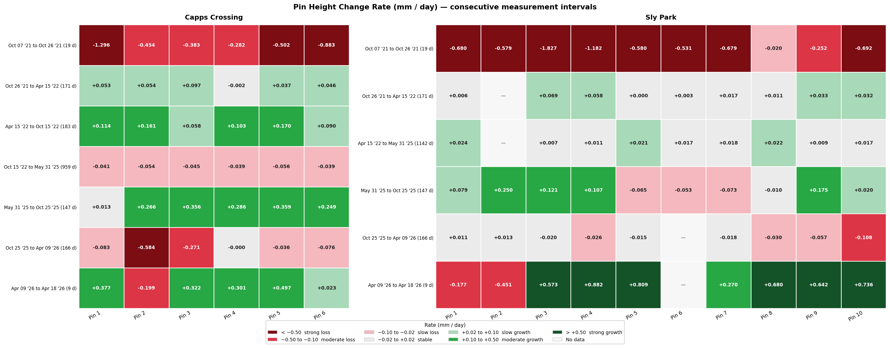
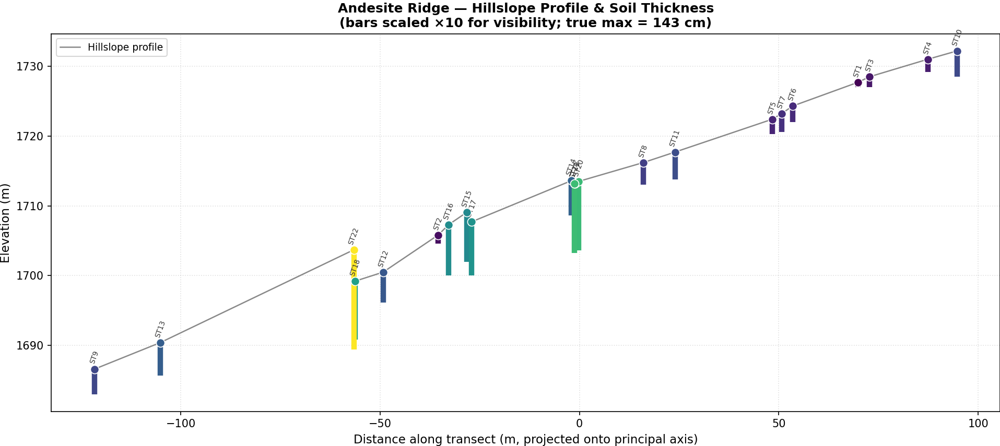
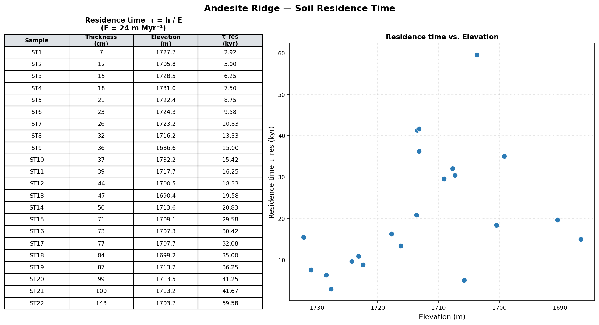
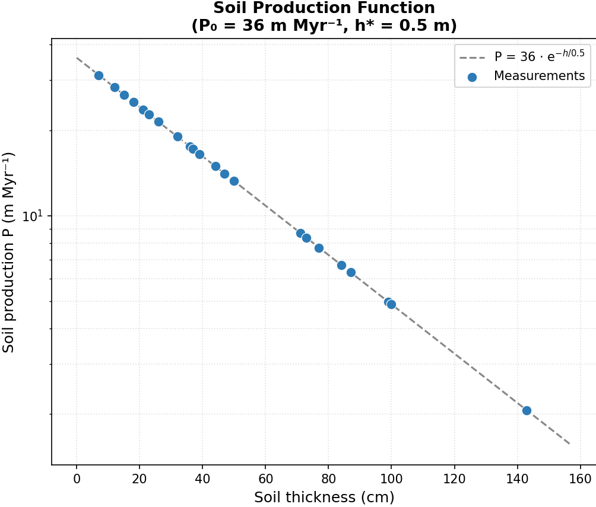
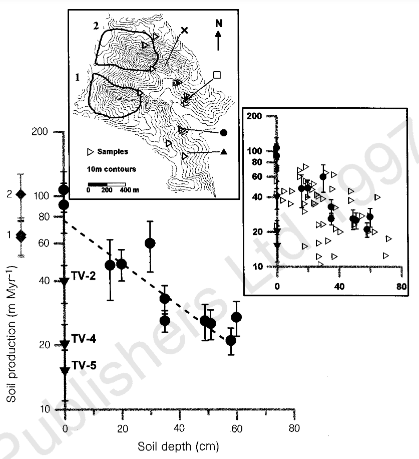

# AI Use Disclaimer:

In order to become more familiar with AI code generation tools, much of the figure generation was done with Claude Code (as opposed to Excel, which I am more farmiliar with). 

I personally certify all of the output represented here, and used AI only as a tool to extend my ability to create and run analysis using python. I did not use AI to "think" for me or complete the assignment. AI was used exclusively as a generating tool, not as a replacement for my own thought. Any and all mistakes are my own.

I am happy to provide any documentation that helps provide a window into my AI use.

# Field Trip Report:

## Handout Introduction

On April 18th, we explored the complex landscape and post-fire mosaic of the Upper Cosumnes watershed on the western flank of the Sierra Nevada east of Pollock Pines, CA. We spent most of our time visiting three soil-mantled hillslopes developing on metasedimentary (Shoo Fly Complex), andesitic (Mehrten Formation), and classic Sierra granodioritic/granitic parent materials, all of which had been variably impacted by the 2021 Caldor Fire.

- At the first (Sly Park, Shoo Fly Complex) and third (Capp's Crossing, Sierra granite) stops, we measured erosion pin heights and dug a soil pit to examine soil formation and horizon development in hillslope soils.
- At the fourth and final stop, we walked the ridgeline across a tor-dotted bedrock landscape and took sporadic soil thickness measurements as we transected back toward the cars.

---

## 1. Direct Measure of Erosion and Sedimentation Along Hillslopes

The erosion pin data we measured at Sly Park and Capp's Crossing is provided separately in two csv files, along with select measurements from the time since the pins were first installed on 10/7/21 (while the Caldor Fire was still raging!). Use these data to inform your answers to the following questions:

### **1.1.** Calculate the difference in height between the pins we measured and the pre-storm measurements on 4/9/26. What do you see? What does this suggest for storm-driven sediment transport in this post-fire landscape?

*Figure description: Capps Crossing is on the top row, and sly park sits on the bottom row. The first figure shows the elevation profile as measured pre-storm, and the post storm level. In the center a table summarizes whether the pin gained or lost material. On the far right, a bar chart puts loss and gain into perspective.*

The figure above summarizes the pin height change between the storm period. We can see that the elevation profile generally lost material higher up the slope. Towards the bottom of the profile, some pins gained material. This data suggests that sediment is quite mobile in post-fire landscapes. The data from this measurement set is well in line with the prediction made by Gilbert's Law of Divides.

### **1.2.** Use the 4/18/26 pin data to assess surface change at the two sites over this past winter (i.e., compare recent measurements against the 10/25/25 data). Describe qualitatively what you see and discuss the implications of this with regards to the seasonality of sediment transport in this post-fire landscape. The figure below can serve as a guide.

*Figure: Daily discharge at the Cosumnes River at Michigan Bar (USGS 11335000) and daily precipitation at Sly Park and Pacific House, El Dorado County. Gray arrows mark erosion pin measurement dates. Red shading indicates the Caldor Fire (August–October 2021).*

The figure above shows a comparison of the two sites over the winter of 25-26 in a number of ways. On the far left, the absolute elevation change is shown, then the pin heights between the three sampling sessions, followed by those same pins placed with respect to their elevations (with an exageration of 300 times the millemeter change to show the relative change more clearly), finally followed by a height change between any pin over the winter, taking the October 2025 pin as the initial height.

> **Note on units:** Pin heights are recorded in millimetres. All elevation values shown in figures are in metres. Where deviations from a baseline are plotted, a vertical exaggeration of ×300 is applied to make millemeter-scale changes visible at the meter elevation scale.

Together the figures shows that sediment was transfered generally down slope. In the figure provided, we are shown percipitation over the area, which appears to come in pulses. There are storms which likely mobalized sediment between October '25 and April '26. We can see some of this geomorphic work in the clear drop of pin 2 at Capps Crossing, which may indicate some mobilization of the hillslope below pin 4 triggered by one of the winter storms. The hight of pin 4 appears to be unaffected, potentially implying that some kind of very small scale debris flow moved the material.

At Sly Park, the effects are less clear. A missing measurement for pin 6 before the storm (from a tree fall onto the pin) complicates interpretation as well. Generally, it seems that compared with the October elevation, the top of the hill decreases slightly to April, while the bottom of the hill either stays the same or increases slightly. The effect is not particularly strong, but is likely there. The sharp rise in pin 6 is likely due to a measurement mistake of the newly bent pin from the fallen tree.

Artifacts in the Sly Park data like the lack of a measureent on pin 6 for the pre-storm April '26 measurement and local sampling bias from dammed sediments may introduce a significant amount of noise into the results.

### **1.3.** What is the cumulative change in surface height for each pin from the date of installation through today? (Think about the various ways this could be calculated….) What is the dominant direction of change? Are there variations primarily at intra- and/or inter-hillslope levels? Discuss what this could mean in terms of surface change, sediment (re-)distribution, and landscape recovery over the past ~4.5 years.

One way to calculate this is to take the net change from the earliest date, to the final date. To see no change in the pin heights, implying that the production rate would be equal to the erosion rate.

From this figure we get the sense that the hill slope of Capps Crossing profile has changed inline with what is predicted by Gilbert's Law of Divides - that material is transported from the top of the hill towards the bottom. More removal has occured at the bottom of the hill than the top.
For Sly park, the relationship predicted by the Law of Divides is less clear. Given the size of the hill (extending many more meters above the highest pin), it is likley that the area with pins accumulates sediment, while the unmeasured area above the pins sheds it. Thus, the pins would show net increases in height, which is in line with the data we see. Additionally, unlike at Capps Crossing, there is a road at the toe of the hill, which prevents large amounts of material from being moved away from the hill and downstream, causing it to accumulate, which we may be able to see in the erosion pins as well.

Another way might be to look at net changes in height over time, with a different set of colors representing the heights, normalized by the elevation where the pin is located. The figure below does just that, helping to provide a sense of how the pins change over the years.

We can see that the profiles are quiete messy. Over the course of the sampeling interval, there are some intresting effects. At Sly Park we can see a generaly erosional trend similar to that observed at Capps Crossing. This is clearly visualized in the exagerated elevation chart, in which lighter closer-to-present values are lower than past darker values. This implies that the starting profile has been worn away by erosion, and generally, it appears that the slopes are loosing mass.

Another intresting feature is in the Capps Crossing chart. In the April measurements, it appears that mass was mobalized from higher up on the slope, and traveled down slope. This is captured by an conspicious rise in the slope at pin 2 which may be indicative of that significant change in mass or a measurement error.

Short term (interval to interval) erosion rates are well visualized in the bar chart on the far right. This figure shows the change in every pin, and indicates that while the net change is not particularly large, the change between samples may be quite large (in the biggest swing, on the order of 150mm!).

As I was thinking about this question, I had an image of the hillslope extruded through time. To that end, and to give the best sense of how those pins changed in time, I decided to make a 3d plot showing the exagerated pin heights on the overall topographic profile, extended through the sampleing interval. This way the change could be assessed on a hillslope basis through time, allowing a more fully neuanced picture of the elevation change of each pin.

> **Note:** The figures below are fully interactive — click and drag to rotate, scroll to zoom, hover for values.

### Capps Crossing


<iframe
  src="/interactive/3d_pin_heights_capps_crossing.html"
  width="100%"
  height="720"
  style="border:none; border-radius:6px;"
  loading="lazy">
</iframe>


### Sly Park


<iframe
  src="/interactive/3d_pin_heights_sly_park.html"
  width="100%"
  height="720"
  style="border:none; border-radius:6px;"
  loading="lazy">
</iframe>


Over the whole interval at Sly Park, there appears to be erosion. Inter measurement changes appear to generally trend in that direction. Intra-measurement responses do show some progressing pulses - especially the one in the lowest 4 pins from 2021, which finally exits the system in the earliest part of the winter of 2025. 

At Capps Crossing, the story is more muddled. The trend is not clearly erosional as it is at Sly Park. Instead the Capps Crossing pins are punctuated by large variations in height. The fewer pins are noisier. Missing data for almost all of 2023 and 2024 also complicates things and makes trends more difficult to identify. Capps Crossing has has also been more effected by fire, and so I expect to see more mobalizeable sediment moving in the system, which on the graph would be brief pulses (as happened between October 25 and April 26.)

It appears that erosion happens slowly and then all at once - where really very little change is present at the profile, before a large pulse comes down and changes the pin heights significantly. This is well inline with predictions from the models what we have been learning in class.

### **1.4.** When was the biggest change in between sampling intervals? When was the biggest change when normalized for time (between measurements)? Does this make sense with seasonal or yearly precipitation trends in the study area?

The figure below shows the net change from sampleing interval for each pin, adjusted by time. Each pin's change can be read across the chart, with each cell showing the size of the change as a color. More red is more loss, while more green is more gain. Values without data are a neutral color.

The largest change time-normablized observed measurement on any pin was at pin 3 at Sly Park October 7 '21 and October 26 '21, when the pin lost 34.72 (based on the difference between the average height) in the 19 day interval.

### **1.5.** Based on the BAER soil burn severity index, soil burn severity was low to moderate at the Sly Park site and moderate to severe at Capp's Crossing. Discuss the erosion pin time series from each site in the context of this burn severity differential. What else is different about the two sites that could help reconcile what might initially appear to be surprising erosion pin data?

For the Capps Crossing site, the overall hill is both less steep and smaller than the Sly Park site. This implies a slower transport rate than at Capps Crossing than Sly Park. However the burn index would suggest the opposite - a stronger burn at Capps Crossing would be expected to make the sediment more mobile than at Sly Park.

The two sites also do not span the full hill slope - from the crest to the creek. Thus sediment would be expected to be mobalized from further up hill, where there is no record, and spread into a flow as opposed to being a single pulse that a fire-effected landscape might be expected to produce.

The end of the hill also may play a roll - at Capps Crossing, the hill terminates at a drainage, while at Sly Park, the hill terminates at a road (and then a river, but the road and its human-managed plowing/erosional regime is likely the important boundary). While both are likely to wisk away deposited soils, the sudden change in gradient upon reaching the flat road at sly park may prevent as much sediment from being removed, and normal hillslope processes from occuring in the same way they would against a river (though the data does not strongly support this conclusion).

I suspect, also, that erosion pin data is just messy in general. There are only a few pins, which do not span the whole hill slope, which can be effected significantly by tree falls (as in Capps Crossing), other effects like ground heave from frost or clay expansion, and human error in the measurement collection process. So while definitely do help tell the sediment balance story, but it may (like any measurement) suffer from inacuracies and biases in the way those measurements are taken.

### **1.6.** Think about the patterns in erosion pin heights at the intra- (within) hillslope level. Assuming this ~5-year record is representative, what does this suggest about the evolution of the two hillslopes in the modern day?

Given the data, it suggests that the hill slope evolves in pulses of material traveling downslope. From the observed trends, hillslope processies are infered to be quite erosional. Soil production would have to be relatively high in order to keep up with material lost. 

These are likely assumptions convoluted by the post-fire nature of this landscape, however.

---

## 2. Soil Thickness and Threshold Landscapes

### **2.1.** Think back to our final stop at the main core site at the hillslope underlain by andesitic tuffs and ignimbrites of the Mehrten Formation. Now think back to George's lecture on hillslope processes and Gilbert's law of divides and law of structure. Which (or both) of these laws seemingly applies at the scale of the hillslope soil thickness transect at stop 4? Which (or both) seemingly applies at the landscape scale across the broader field area?

I made another 3d plot of all the pins: 


<iframe
  src="/interactive/soil_thicknes_3d"
  width="100%"
  height="720"
  style="border:none; border-radius:6px;"
  loading="lazy">
</iframe>
 

To better visualize the points, the figure below shows them projected through the center of the point cloud presented above. This allows a 2d visulaiziation of the measured soil depth for each point.

Gilbert's Law of Divides would hypothesize that the deepest part of the soil profile would be at the toe of the slope, while the thinnest is at the crest of the slope. This is because soil "flows" only down hill, under the influence of gravity, which accumulates material at the base of the hill, leaving the creast of the hill with thinner soils. 
It appears that the soil profile follows this trend at first - thin soils dominate the crest of the hill, thickening by the middle of the profile. However, at the base they get thin again. Partly this could be because of human geomorphic work (a road is built at the bottom of the slope) but it could also be a lithologic contact, suggesting a role in the eevolution of the hill slope by the underlying structure.

In our stop at the road cut with the andisitic tuffs and ingbrites, we were shown a clear example of how the lithology of the area helps to dictate the evolution of the hill soil thickness. Here the law of structure would dominate. This same kind of thing could be happening in the andesite of the stop 4 hill as well. Different units, with different erosion suceptabilities would produce soil at different rates. However, without a carefull observation of the lithology, it is hard to deconvolve whether the lithology or the human work (or incomplete measurements) created the observed thinning at the toe of the hill.

For the rest of the hills on our field trip, it is also difficult to determine. Off what amounts to my own (falable) memory, and total speculation, I would suggest that the granites of Capps Crossing and the higher reaches of the Sierras more generally, would tend to weather into thicker soil mantles, governed more by the Law of Divides, assuming that the uplift rate was sufficiently slow. In the accretionary material making up the Shoe Fly complex, I would expect that the different hardnesses of the lithologies would tend to show structure mattering more. The andesites have already been touched upon in the paragraph above, and I would expect, given our view of the road cut, those rocks to be more variable in their soil mantles, showing more law-of-structure than law-of-divide in their accumulated soil catenas. However, I suspect that the erosion of any particular unit would be around the same value, with uplift rate and local hillslope, exposure to weather, anthropogenic soil reworking, and bioturbation to all have a larger effect on soil production than lithology. Within the unit, there may appear differences (as there seems to be in the hillslope profile for the andesite ridge) but I would expect larger differences between units.

In summary, it appears that the Law of Divides helps to create the upper portion of the soil catena for stop 4 (from the crest to about the midpoint), however as measurements progress down slope, they thin out implying either a structural change, a human intervention, or inconsistent data collection. For other stops, it is hard to accurately speculate, but I suggest that inter-unit differences produce more variation than intra-unit differences, though both will have effects. 

### **2.2.** Hilltop curvature ($C_{HT}$) is $-0.0077\ \text{m}^{-1}$ on canyon-adjacent ridges near stop 1 (Sly Park erosion pins), $-0.0030\ \text{m}^{-1}$ on the interfluves surrounding Capp's Crossing at stop 3, and $-0.0027\ \text{m}^{-1}$ on the andesitic ridges like the one we walked up to at stop 4. Calculate the diffusivity/soil transport coefficient $K$ ($\text{L}^2/\text{T}$) assuming a long-term erosion rate of $24\ \text{m Myr}^{-1}$ for hillslopes in Mehrten andesites, $33\ \text{m Myr}^{-1}$ for the granites, and $49\ \text{m Myr}^{-1}$ for the Shoo Fly metasedimentary hillslopes adjacent to the canyon.

For this question it is worth noting what kind of geology each site presents. 

At Sly Park, the dominant geology is the Shoe Fly complex with an erosion rate of $49\ \text{m Myr}^{-1}$. Capps Crossing is domainated by the Sierra Granite with an erosion rate of $33\ \text{m Myr}^{-1}$. Our last stop is dominated by andesite eroding at $24\ \text{m Myr}^{-1}$.

This data has been integrated into the chart below, and Diffuisivity has been calculated as:

$$k = -\frac{E}{\nabla^2 z} \approx \frac{m^2}{\text{Mya}}$$

The Diffusivity can be found in the last column of the table below. 

| Site | Erosion Rate ($\text{m Myr}^{-1}$) | Laplacian (hilltop) Curvature ($\text{m}^{-1}$) | Diffusivity Index $K$ (${m^2}{\text{Myr}^{-1}} $) |
| -------- | -------- | -- | -- |
| Sly Park | 49 | -0.0077 | 6363.63 |
| Capps Crossing | 33 | -0.0030 | 11000.00  |
| Andesitic Ridges | 24 | -0.0027 | 8888.89 |

### **2.3.** Use the quantities you derived (as well as those that were given) in 2.2 to validate your answer to 2.1. In other words, describe how $C_{HT}$, $E$, and $K$ inform hillslope form and the competition between the law of divides vs the law of structure across the study area.

In 2.1, I argued that the soil production curve was inline with the prediction made by the Law of Divides through the upper half of the profile, but thinned out more than predicted by the law of divides in the second half, implying a change in lithology.
In part 2.2 we were given erosion rates, and curveatures to calculate the diffusivity - or how quicky soil moves down hill. 
The question here asks us to consider, given our calculation of diffusivity, whether that would change our answer to 2.1.
(I was confused by this question, so wanted to lay out what I was actually answering).

Assuming that the lithology at the 4th stop was not either made of the 

---

## 3. Sediment Transport on Hillslopes Across Timescales (from the CORREGENDUM)

### **3.1.** How do site-specific long-term erosion rates (provided in 2.2) compare with short-term rates of erosion/accumulation over the past 5 years (calculated in 1.3)? Why?

The short term rates are significantly more variant (both higher or lower) than the longterm rates. The effect is called the Sadler Effect, and articulates the fact that over a longer integration time, an observed rate effected by individual events tends towards zero.

### **3.2.** Using the long-term erosion rate ($E$) for each site, predict the steady-state (average) soil depth at Sly Park ($P_0 = 66\ \text{m/Myr}$, $h^* = 0.5\ \text{m}$) and Capp's Crossing ($P_0 = 44\ \text{m/Myr}$, $h^* = 0.5\ \text{m}$). How do predictions compare with field observations? *Hint: at steady state, you can assume that the soil-production rate, $P = E$.*

Starting with:
$$ P = P_0 e^{-h/h^*} $$
then solving for h:
$$-h^*\cdot ln(\frac{P}{P_0}) = h $$
\text{substituting for the stead state} $P = E $:
$$-h^*\cdot ln(\frac{E}{P_0}) = h $$

| Capps Crossing | Sly Park |
| --- | --- |
| $$-0.5\cdot ln(\frac{33}{44}) = 0.1438\,m$$|$$-0.5\cdot ln(\frac{49}{66}) = 0.1489\,m $$ |

These results appear to differ quite significantly from out field observations. From digging the soil pit at Sly Park, the soil thickness was certainly greater than a meter. This makes sense, though, because the soil thicknesses we dug through recieved material not only from production, but also from erosion down slope. This would accumulate soil material ontop of the profile, and deepen it. The number the equation generated would apply to an area without active erosion, like the ridge crest. That makes it seem more believable - if still fairly small. 

### **3.3.** Estimate the soil residence timescales at both sites. *Hint: The residence timescale is the time required to erode one full soil thickness.*

Starting with the equation for residence time:
$$\tau_{res} = \frac{h}{E}$$
Where h is equal to our soil thickness calculated in **3.2**

| Capps Crossing | Sly Park |
| --- | --- |
| $$\tau_{res} = \frac{0.1438}{33} = 0.004357 \,My \\ = 4,357\,\text{years} $$|$$\tau_{res} = \frac{0.1489}{49} = 0.003038 \,My \\ = 3038\,\text{years} $$ |

### **3.4.** The `andesite_ridge_soil_thickness_curvature` attribute table provides your field measurements of soil thickness. Use them to calculate the residence timescale of soil along those slopes. Do these make sense, and why?

We are given the erosion for the site in **2.2**, at $24\:\text{m}\, \text{Myr}^{-1}$. This rate goes into our residence time equation $\tau_{res} = \frac{h}{E}$.

Mean residence time: 21.61 kyr | Min: 2.92 kyr  |  Max: 59.58 kyr

Yes, the chart makes sense. It would take longer for a larger thickness of soil to be moved by standard erosion than for a smaller thickness. It is possible to overturn the whole soil profile down to bedrock all at once as in a landslide (if the rare conditions for such a thing are present), but this is likely not the case.

So for thicker soils, it will take longer for them to totally overturn.

### **3.5.** For the andesite ridges, make a plot of soil thickness vs. elevation. Does it make sense, and why? Calculate the soil production rate, $P$, in $\text{m/Myr}$ using $P_0 = 36\ \text{m/Myr}$ and $h^* = 0.5\ \text{m}$. Generate a plot of $P = f(\text{soil thickness})$, with the y-axis in log scale. How do these compare with soil production rates measured by Heimsath (1997) at Tennessee Valley (see plots in lecture slides)?

**Part 1 Plotting soil depth against elevation at Andesite Ridge:**

Generally, our soil should get thicker as we decend the slope, exclusively by the accumulation of mass from higher up the profile. For the majority of the points in the chart, that relationship holds. I have fitted a line to these points.

The part that does not make sense is at the end, where the profile suddenly thins. This is likely due to the geomorphic work done by humans at the site of the road at the toe of our section of the hill. I assumed this included the last two points of the plot (though this is purely an assumption on my part based on my own memory of sampling) and fitted a line to those points which I have colored orange.

The variance of the points is due to hitting rocks or other obstructions in the soil profile, which may not have provided the best sense of the regolith depth.

**Part 2 Production rate calculations:**

Given a set of thicknesses:

Starting with the equation for production rate:
$$ P = P_0 e^{-h/h^*} $$
With: 
$$
P \;\text{on the Y axis, as a log scale} \\
P_0 = 36\ \text{m/Myr} \\
h \;\text{on the X axis,} \\
h^* = 0.5\ \text{m}
$$

**Part 3 Comparison with Heimsath (1997):**

This is the same kind of analysis that Heimsath does. He plotted production against soil thickness in order to show that the relationship was as preducted by the equation. 

The chart above for our Andesite Ridge survey gives us our production curve through the depth profile (the equation in the upper right). This is the most important piece of data provided by the chart.

Heimsath's plot (copied from the paper below) includes points that do not fall directly on the line like our data does. This is because he had an independent measurement for $P$ using ${}^{10} \text{Be}$ and ${}^{26} \text{Al}$ isotopes. Thus, he was able to independently verify the relationship between soil thickness and soil production is in the Tennesee Valley (and by extension other places as well). 
Our measurments fall directly on the line because, unlike Heimsath, we do not have an independent assessment of $P$.

