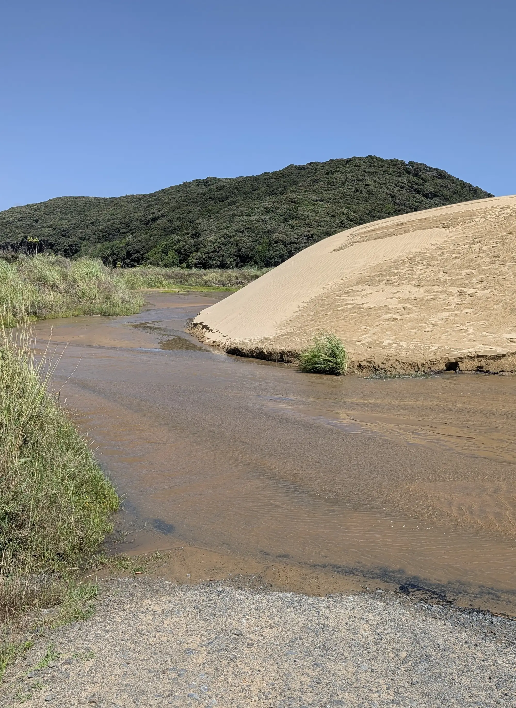
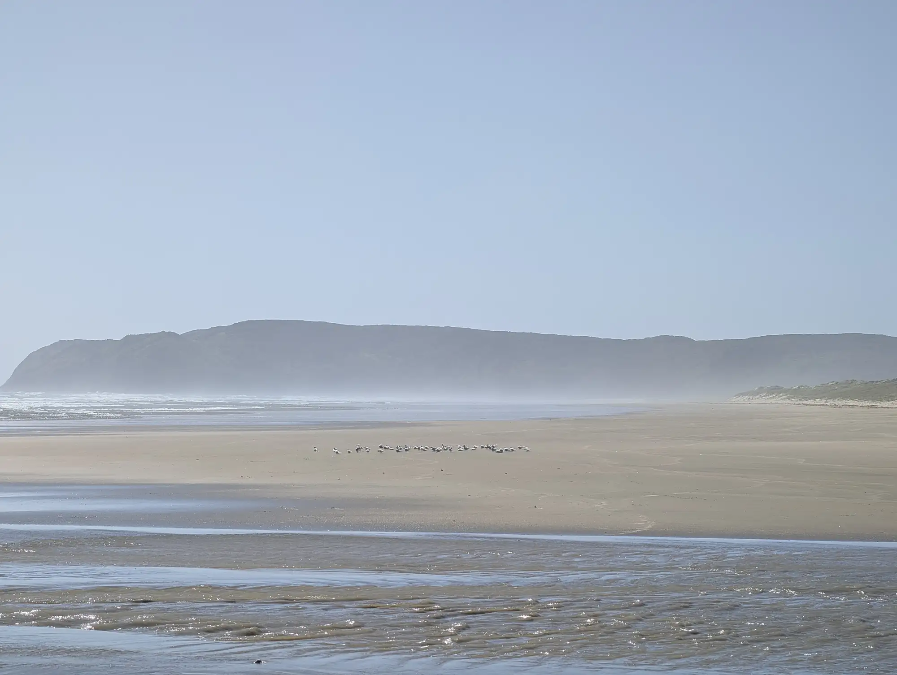
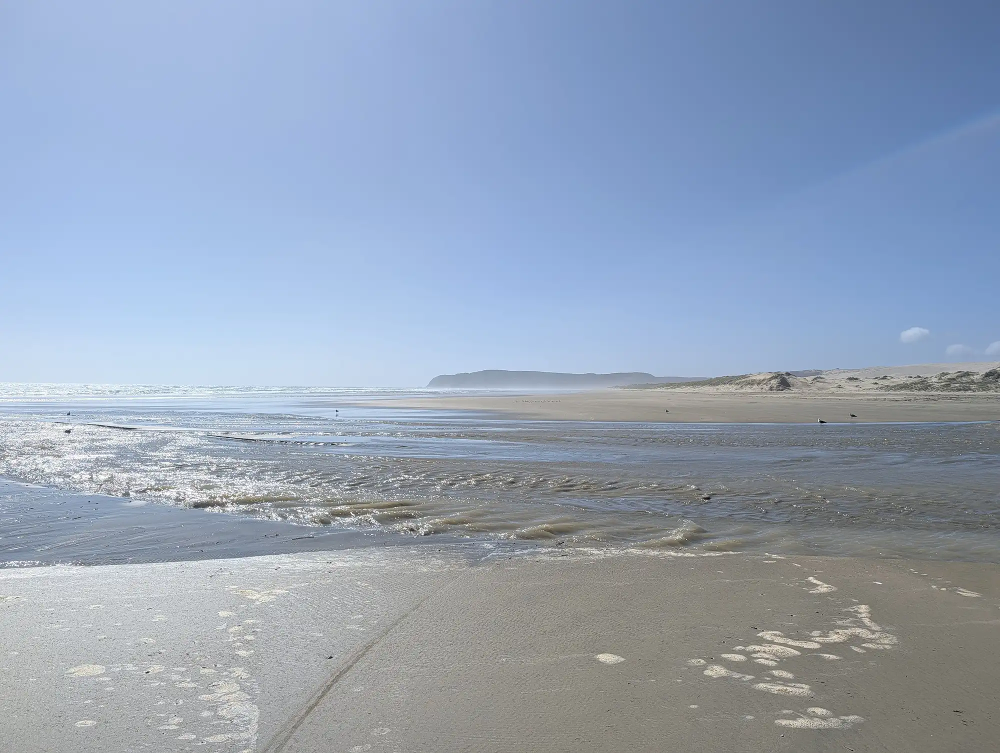
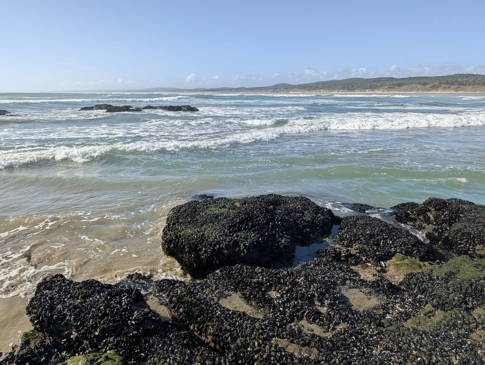
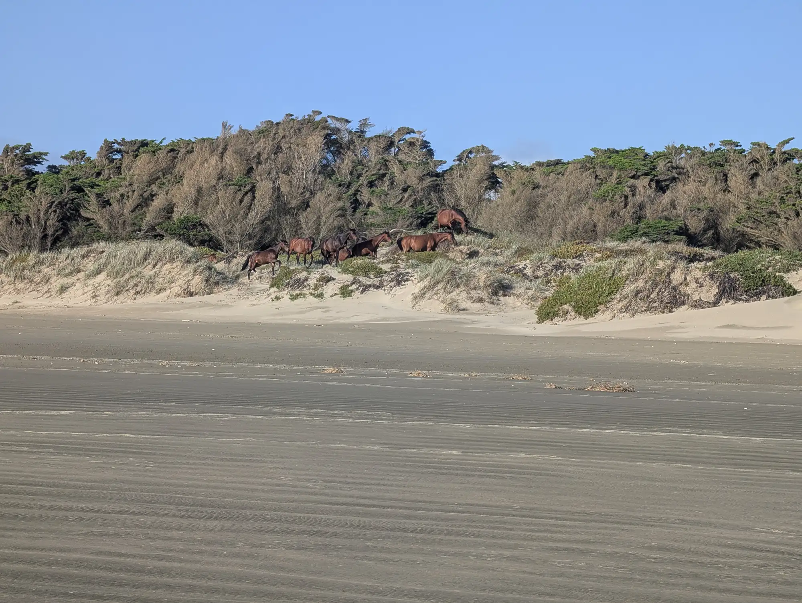
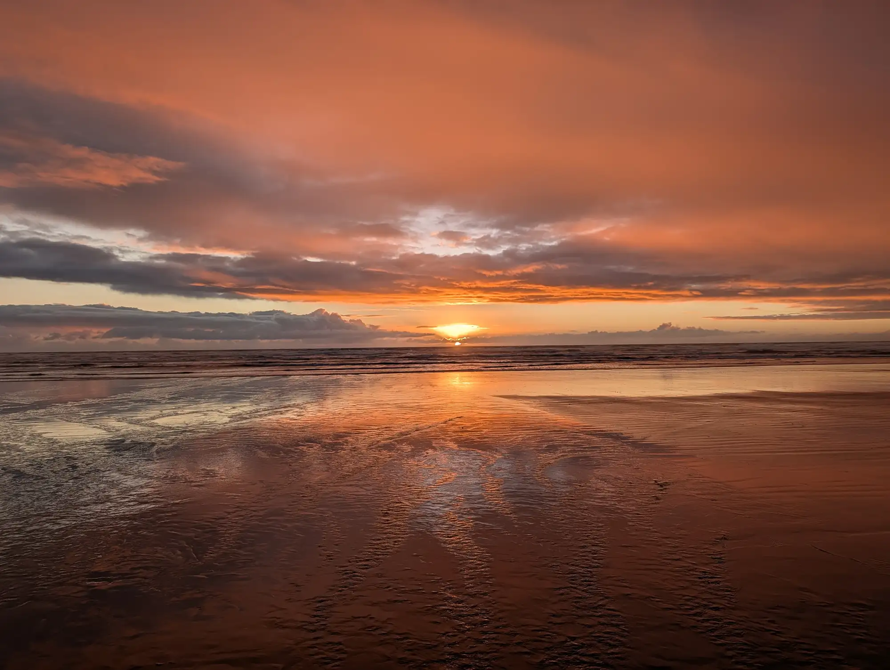

When last I posted, I was descending a hill, laughing out loud at the beginning of a wild adventure - one which had only just begun.

Cut to black, roll credits. 

Of course, real-life adventures are not like their movie versions.

The descent flattened out and became a climb. What goes down must, in all likelihood, go back up, and the hills in New Zealand almost guarantee this near certainty.

I pedaled through my upper gears, milking my kinetic energy for all it was worth. Click. I shifted down a gear as I bled more speed, and the cadence of my pedal strokes started to fall. Click. Another shift, down again. Click. Another.
What was descending before began to steepen into a pretty serious climb. Two clicks up shifted my gears so that I could stand and put my full weight on the pedals. I cranked for a bit, but the hill just kept going. Click, this time down. Defeat. It was a big hill. I sat back down to grind it out.

My crazy adventure kept going, one pedal stroke at a time, in all of its gritty reality. Starting the Track at the lighthouse just 30 minutes before felt gratifying, but in my reality, very little had actually changed. I was still riding my bike, still climbing a hill, and sweating through my shirt under the same hot sun.

"And this," I thought, the cranks of my pedals are only turning my thoughts, "is how a real adventure actually works."
These kinds of adventures - lives for that matter - are composed of moments that make it into the story (starts, high points, and ends), surrounded by all the mundane moments that do not (climbing the hills in between). Those moments that make up the mundane background are like the "boring" meat-and-potatoes of life. It's a background that nourishes the adventurer to (and through) the ice cream and Chardonnay highlights.
And while those highlights are sweet, I find myself drawn to those mundane meat-and-potato moments just as much.

The hill passed eventually. I found my rhythm, and the meters of elevation ticked away.
Following my loaded GPS map, I took a wide right onto a road with a sign for the Giant Te Paki Sand Dunes. I was excited. I'm a sucker for seeing cool things, and this was no exception.

The black line I was following curved around the base of the dunes, and then along their base, crossing a wash which was quite full from the rains over the past few days[^1]. 

I looked down at my GPS track - it seemed to go dead-center through the stream. I checked the guidebook. Apparently, there was a well-packed sand road that traveled right around the dunes. The guidebook read:

>"Turn right at Te Paki Stream Rd. It’s gravel followed by sandy tracks beside, and sometimes in, the stream."

'Beside!?' I thought.
'Seems to me that IN would be a more accurate preposition to describe this situation.'

Suspecting I had made a navigational error, I checked yet again and found that, indeed, this was the right road.

I considered my options[^2]. I could push the bike through the river, but I worried about sinking into the sand. I could go over the sand dunes, with potentially the same issue, or I could find another way around the creek - another entrance on a logging road, or a helicopter, perhaps.

'Well,' I thought, taking off my shoes and socks and rolling up my pants to my knees.
'Nothing to it but to crack on.'
With the decision made, I rolled the bike into the stream.

Much to my surprise, the sand was pleasantly firm, an improvement on my expectations. The going was not actually that bad. In fact, it was quite peaceful. The clear water splashed with each step, coalescing around my ankles. My toes dug into the sand with each step. It became a fun challenge to find the best firmest path through the river's banks, bars, and channels of the braided stream.

Along the way, I stopped briefly to climb a sand dune and eat some cattails. Life was good, even with the water. 

As I got closer to the beach, the sand flattened out, becoming less compacted and making the walking slightly more arduous. My feet, as well as the bike, dug in that much more, and the sand was generally looser. But the end was in sight. 

As all things do, the creek section came to an end, and the expanse of the Tasman Sea was laid out ahead of me. Waves crashed onto a beach that stretched into a distant haze. White seabirds dotted the beach and sky tucking themselves against the wind, which drove from the west off the water. The landscape appeared to be infinite in all directions except the way I had come. 

I put my shoes[^3] back on and let about 10 psi of air out of my tires. Then I considered my drinking water. I filled up at the cape, but had consumed most of the water by the time I reached the beach. Fearing running out, I contemplated filtering and refilling. I remembered from the guidebook that riding on the beach required a rider to carry most of their water through the section. I decided that I would take the time and fill up my water before departing the stream. I absolutely did not want to run out and be forced to ride the whole beach in a single, desperately thirsty attempt.
I stooped down to the stream and filled the pouch of my Sawyer filter, then squeezed its contents through the screw-on filter. 750ml at a time, I refilled my water supply. With that completed, I remounted and continued down the beach. 

 

It was beautiful! The sand was hard-packed from the low tide, and a thin skim of water reflected the sky as I rode. The mirror image lay out before me, becoming grey in the haze ahead.
The long day (which had grown in the vicinity of 100km up to the Cape and now back down the beach) was starting to feel smooth. The wind was at my back, and it felt that the road was finally rising to meet me a truly glorious state.

Right about then, I passed over a small stream running its way into the ocean. My shoes, which I had worked so hard to keep dry through the earlier river walk, were immediately and unceremoniously soaked from water spat up by my tires.
'Welp,' I thought, 'so much for that.'
Followed one moment later by another thought. 
'If the rain filled the starting track ankle deep, I would bet good money that the whole beach is filled with little streams which could provide a drink if need be.'

My suspicion proved correct. There was PLENTY of fresh, filterable water on the beach. And every stream I passed soaked my shoes just as they finished drying.

The only thing I really needed to do for the day was pass a place called The Bluff, where the ride can pinch out the beach against a spot of rocks. At low tide, the area is passable, but high tide would require either an uncertain portage or a 6-hour wait. 
Luckily, the spot was closing in fast, so fast, in fact, it was fully clear when I arrived, only an hour after I started my beach pedal.

With the hard part within easy reach, I decided to stop and check for muscles on the rocks to augment my dinner. I found some - New Zealand green lipped muscles - which I was very excited about. I collected the larger, plumper mussels, making sure not to overharvest any particular location, and leaving the smaller individuals behind.

With my seafood dinner safely onboard, I crossed The Bluff. A major milestone had been crossed, and now I was home free to find a spot to camp.

I decided to ride until the next stream before setting up camp. Along the way, I saw a herd of wild horses standing in the storm-blown sand, watching my progress along the beach.

When I arrived at the next stream, shoulders and legs aching from the long day in the saddle, I pushed the bike over the first set of powdery dunes into a depression where I hoped the wind would not be too bothersome. I put up my tent, tied my socks to one of the poles to dry, and ran to take a cooling dip in the blue-grey ocean to wash the sweat from my body.

After my dip, I went to cook dinner and eat the mussels I'd just collected. I sat and ate, watching the sunset. In the bowl was a simple dish of rice noodles, the mussels with a pinch or two of salt and a sprinkle of chili flakes. It was delicious.

Looking out as the sea exploded into the gentle reds and purples of sunset, I thought about my day. I thought about the resignation I had when first encountering the flooded trail. And later, I realized the same water had become a source of adulation: it enabled drinking water and easy camping at a spot of my choosing, all to myself. The two likely had the same cause - the recent flooding rain - but had led to very different results for me.
It appeared that there was always a silver lining to be found. There seemed, at the root cause, to be many cascading effects from any action or factor that were both positive and negative for my goal. The rain had brought both good and bad, and I suspected that many other moments which I had considered purely good or bad before had a root cause that created a mix of both.

It wasn't that life had given me lemons, and I had made lemonade, rather life had given me a farmer's box of lemons, some of which were ripe and some that were not. Some of the lemons were picked a bit too early and were very sour while others were perfect, and sweet. All had the wonderful taste of farm-fresh food, and I was grateful for the whole box, even the sour ones.

When the sun set, the stars came out in their ones and twos. By the time I had our away the pot, the sky had become a tapestry filled with pinpricks of light. 

'What a day!' I thought as I rolled into a deep sleep.

### Footnotes:

[^1]: It had actually rained quite a large amount. The forecast called for around 120mm on the worst day (about 4.75 inches), which pretty much came to pass. This rain had actually been so bad that land slides were caused throughout the region, one of which killed six people - something like that, I didn't follow it closely on the road. And apparently, the rain was quite unusual. Every Kiwi I came across apologized for the lousy weather, which, flooding aside, I didn't consider too bad.

[^2]: In these moments - moments where you need an idea - I generally stick to a simple exercise I learned in my design training. I first identify the obvious solution - the one that, at first blush, would probably work. Generally, this one is neither bad nor good. Then I come up with another idea that is an alternative to the first, using only original elements. So no parts from the first idea can be in the second. Then I do the exercise one more time, using again only new elements. This is where the wheels have to come off a bit, and it feels like you're grasping at straws that won't work. Let your imagination really run wild here. You've got it when you can present an outlandish idea with a straight(ish) face - the feeling is called by some, creativity. If I am making a very important decision, I'll sit a bit longer and try to come up with one or two more totally novel solutions. The goal is to generate bits and pieces of what will become my master plan, which are then composited into something usually much better. It also never takes very long. I find that my first idea is almost never the best idea I can come up with using the method outlined above. 

[^3]: Specifically, I am referring to cycling shoes with a built-in metal cleat to catch the pedals, allowing a rider to "clip in". They have a very stiff sole to transfer power from the whole foot to the pedals. Additionally, they allow a cyclist to provide power on the upstroke (allowing power from the hip flexor and hamstrings) and, as importantly, they tie a rider's feet into the pedals, preventing slippage. I always ride on clips, even on the mountain bike. I love them.
